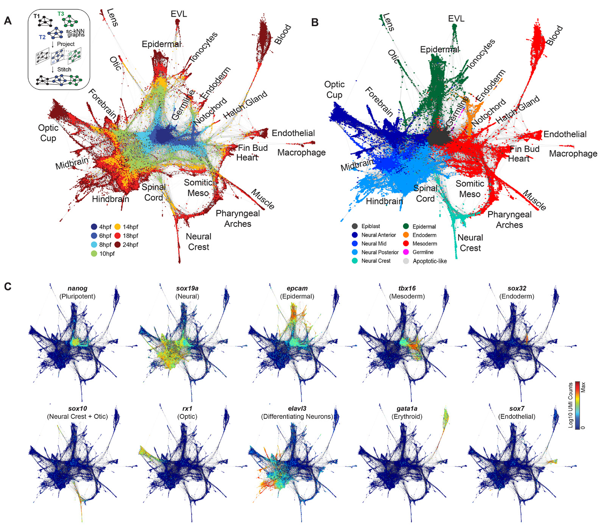

# Erica
single-cell and spatial transcriptomics data analysis toolkit

1. This approach first constructs a single-cell k-nearest-neighbor graph for each timepoint ti, with nodes representing cells and edges linking neighbors in a low-dimensional subspace;
2. it then joins the graphs by identifying neighboring cells in pairs of adjacent time points, using a coordinate system learned from the future (ti+1) timepoint (see methods).
3. The resulting graph spans all time points, and allows application of formal graph-based methods for data analysis.

> Single-cell mapping of gene expression landscapes and lineage in the zebrafish embryo. Wagner DE, Weinreb C, Collins ZM, Briggs JA, Megason SG, Klein AM. Science 26 Apr 2018. doi:10.1126/science.aar4362