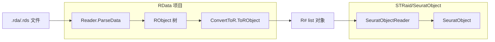

## 用户需求

在 STRaid/SeuratObject 文件夹中实现一个基于现有 RData 项目的 Seurat 对象 (.rda/.rds) 数据读取模块。

## 产品概述

实现从 GNU R 生成的 Seurat 对象文件（.rda/.rds）中读取空间转录组/单细胞转录组数据。读取流程为：rda/rds 文件 → Reader.ParseData() 解析为 RObject 树 → ConvertToR.ToRObject() 转换为 R# list → 从 list 中提取各槽位数据构建强类型的 SeuratObject 类。

## 核心功能

- 读取 Seurat v5 对象的所有核心槽位数据（assays、meta.data、reductions、images、version 等）
- 将 assays 中的表达矩阵（counts、data、scale.data）提取为可用的矩阵数据
- 提取细胞元数据（meta.data）和降维嵌入（PCA、UMAP 等）
- 提供清晰的 SeuratObject 类结构，包含 Assay、DimReduction、SeuratImage 等子类型
- 通过 GNU R 脚本生成测试数据，在 STRaid/test 中编写完整的验证测试
- 修复 RData 项目中解析 Seurat 对象时发现的 bug（CLO/BCODE 等未实现类型的处理）

## 技术栈

- 语言：VB.NET
- 目标框架：net10.0
- 核心依赖：RData 项目（R 数据解析）、R# 项目（R# 运行时对象类型）
- 解析流程：rda/rds 文件 → Reader.ParseData() → ConvertToR.ToRObject() → SeuratObject 构建

## 实现方案

### 整体策略

基于现有的三层读取架构（文件检测 → XDR 解析 → R# 对象转换），在 STRaid/SeuratObject 中新增一个 `SeuratObjectReader` 模块，负责从 R# `list` 对象中按 Seurat S4 槽位结构提取数据并构建强类型的 `SeuratObject`。

### 关键技术决策

1. **S4 对象处理**：Seurat 对象在 RData 解析后是一个带 `.class = "Seurat"` 的 R# `list`，ConvertToR 已对 S4 对象做了特殊处理（创建独立 list，`.class` 从 attributes 提取）。根据 diag_out.txt 的实际输出，`.class` 当前为 `@NOCLASS@`，需要修复 ConvertToR 中 S4 class 名称提取逻辑。

2. **稀疏矩阵处理**：Seurat v5 的 assay layers 使用 dgCMatrix（稀疏矩阵），序列化为包含 `i`、`p`、`x`、`Dim`、`Dimnames`、`factors` 等元素的 list。需要识别这种结构并重建矩阵。

3. **未实现类型处理**：diag_out.txt 显示 CLO（closures）、BCODE（Byte code）、FUNSXP 等类型在 Seurat 对象中出现但未被 Reader 实现。这些是 Seurat 对象中存储的 R 函数/方法引用，读取时不需要实际数据，应将其跳过并返回 Nothing 而非崩溃。

4. **NullReferenceException 修复**：diag_out.txt 显示在读取 `factors` 槽位时发生 NullReferenceException（SeuratDiag.vb 第21行 `l.getByName(".class")` 对非 list 对象调用）。SeuratDiag.vb 的 Dump 函数需要防御性检查。

### 实现细节

#### 修复 RData 项目问题

**Reader.vb 修改**：在 `parse_R_object()` 中为 CLO (3)、PROM (5)、BCODE (21)、EXTPTR (22)、WEAKREF (23)、SPECIAL (7)、BUILTIN (8) 等类型添加跳过逻辑。这些类型在 Seurat 对象中作为闭包/字节码/函数引用存在，读取时不需要其数据，应返回 Nothing 并加入引用表。

**ConvertToR.vb 修改**：修复 `GetS4Class()` 函数。当前 class 属性查找可能失败（返回 `@NOCLASS@`），需要改进从 attributes 中提取 class 名称的逻辑。

#### SeuratObject 类设计

核心类层次：

- `SeuratObject`：顶层类，包含 `Assays`、`MetaData`、`Reductions`、`Images`、`ActiveAssay`、`ActiveIdent`、`Version`、`Commands` 等属性
- `SeuratAssay`：单个 assay 数据，包含 `Counts`、`Data`、`ScaleData`、`Key`、`var.features` 等
- `DimReduction`：降维结果，包含 `cell.embeddings`（矩阵）、`feature.loadings` 等
- `SeuratImage`：空间图像信息，包含坐标、scale factor 等

数据转换方法：

- 从 R# `list` 提取命名的 assay 列表
- 从 R# `dataframe` 提取细胞元数据
- 从 R# `vector`/`matrix` 提取表达矩阵和嵌入坐标

#### 测试方案

- 修改 `gen_test_seurat.R` 添加更多测试场景（空间 Seurat 对象如有需要）
- 在 `Program.vb` 中添加 SeuratObject 读取测试，验证所有槽位数据完整性
- 修复 `SeuratDiag.vb` 的 Dump 函数中的 NullReferenceException

### 架构设计



### 目录结构

```
STRaid/
├── SeuratObject/
│   ├── SeuratObject.vb        # [MODIFY] 扩展为完整的 SeuratObject 类，包含所有槽位属性
│   ├── SeuratAssay.vb         # [NEW] Assay 类型定义，包含 counts/data/scale.data 等矩阵
│   ├── DimReduction.vb        # [NEW] 降维结果类型，包含 cell.embeddings 等
│   ├── SeuratImage.vb         # [NEW] 空间图像信息类型
│   └── SeuratObjectReader.vb  # [NEW] 核心读取模块：从 R# list 提取数据构建 SeuratObject
├── test/
│   ├── Program.vb             # [MODIFY] 添加 SeuratObject 读取验证测试
│   ├── SeuratDiag.vb          # [MODIFY] 修复 NullReferenceException，增加防御性检查
│   └── gen_test_seurat.R      # [MODIFY] 增强测试 R 脚本，添加更多场景
```

以及 RData 项目修复：

```
G:\GCModeller\src\R-sharp\studio\RData\
├── Reader.vb                  # [MODIFY] 添加 CLO/BCODE/PROM/EXTPTR 等类型的跳过处理
└── Convertor/ConvertToR.vb    # [MODIFY] 修复 GetS4Class 的 class 名称提取
```

## 实现注意事项

### 性能考量

- 稀疏矩阵（dgCMatrix）的重建需要遍历 i/p/x 三元组，对于大型数据集（10万+细胞），需注意内存使用
- 对于不需要的闭包/字节码节点，直接跳过而非深度解析，避免不必要的递归

### 错误处理

- 使用 Try-Catch 包裹每个槽位的提取，单个槽位失败不影响其他槽位
- 为未实现类型提供明确的 fallback（返回 Nothing），防止整个解析流程中断

### 日志

- 使用现有的 `Console.WriteLine` 风格日志，与现有项目保持一致
- 对跳过的类型、失败的槽位提取输出 warning 信息