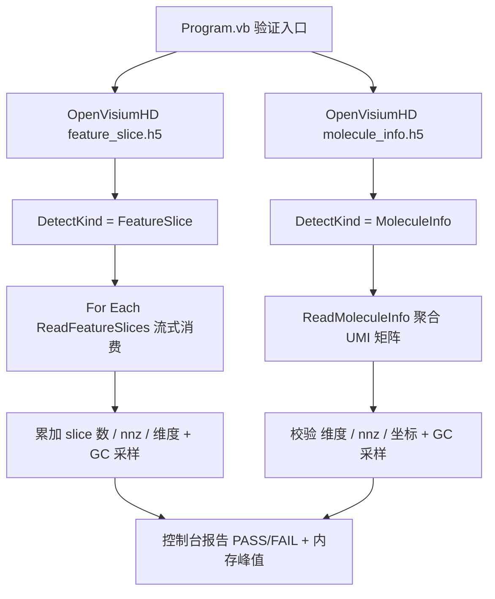

## 用户需求

在空白测试项目 `G:\Erica\src\STRaid\test` 中编写验证程序，调用已实现的 `TenXReader` 流式稀疏读取能力，针对两个真实的 Visium HD 10x Genomics hdf5 文件（位于 `C:\Users\Administrator\Downloads\`）进行读取测试，确认不 OOM 且结果正确。

## 产品概述

提供一个独立的控制台验证程序：接收两个测试 h5 文件路径，分别调用 `TenXReader.OpenVisiumHD` 完成 `feature_slice.h5` 与 `molecule_info.h5` 的稀疏解析，打印结构探测结果、矩阵维度、非零元数量、barcodes/features 元数据规模，以及 GC 内存峰值作为不 OOM 的量化证据，并对关键不变量做正确性断言。

## 核心功能

- 类型探测：对两个文件分别调用 `OpenVisiumHD` 确认 `DetectKind` 正确识别 FeatureSlice / MoleculeInfo。
- feature_slice 验证：遍历流式 `ReadFeatureSlices` 产出的每个分片 `SparseMatrix`，累计分片数、总 nnz、行/列维度，校验 row/col 落在合法范围；输出 barcodes 与 features 数量。
- molecule_info 验证：调用 `ReadMoleculeInfo` 聚合出 UMI 稀疏矩阵，打印最终维度（nBarcodes × nFeatures）、nnz、moleculeCount，校验 nnz ≤ 原始分子行数且坐标合法。
- 内存监控：在读取前后及峰值处采样 `GC.GetTotalMemory`，输出量化内存占用。
- 正确性断言：基于已知不变量（坐标范围、nnz 上限、维度匹配）做运行时校验并报告 PASS/FAIL。

## 技术栈选择

- 语言/框架：VB.NET（.NET 10，与测试项目 `test.vbproj` 的 `TargetFramework=net10.0` 一致）。
- 复用依赖：测试项目已引用 `STRaid.vbproj`、`HDF5.vbproj`、`Math.NET5.vbproj`、`Microsoft.VisualBasic.Core`，可直接调用 `Erica.Analysis.SpatialTissue.RaidData.HDF5.TenXReader` 与基础 `Microsoft.VisualBasic.Math.LinearAlgebra.Matrix.SparseMatrix`。
- 验证输出：控制台 `Console.WriteLine` + sciBASIC `__DEBUG_ECHO`（来自 Core）打印进度与结果。

## 实现方案

### 总体策略

仅在测试项目 `Program.vb` 中填充验证代码（不改动已交付的核心读取实现）。程序接收两个文件路径常量（或命令行参数），依次执行 feature_slice 与 molecule_info 两条验证路径，并在关键节点采样 GC 内存。

### 关键技术决策

1. **复用 `OpenVisiumHD` 统一入口**：两条路径都通过 `TenXReader.OpenVisiumHD(path)` 触发，内部自动 `DetectKind` 分流，避免重复构造读取逻辑，也验证了统一入口的正确性。
2. **feature_slice 走流式遍历**：用 `For Each slice In result.featureSlice` 消费 `ReadFeatureSlices` 的 `IEnumerable(Of FeatureSliceData)`，每消费一个分片立即累加统计后释放引用，使内存峰值维持在单分片量级（符合前期"流式 yield 避免 OOM"设计）。
3. **molecule_info 直接消费结果**：`ReadMoleculeInfo` 内部已做流式聚合，验证程序仅读取返回的 `MoleculeInfoMatrix.matrix` 的 `RowDimension/ColumnDimension` 与内部 nnz；nnz 通过基础 `SparseMatrix` 公开 API 获取（若私有字典不可直接枚举，则通过 `matrix.RowDimension * matrix.ColumnDimension` 范围与 `moleculeCount` 间接校验，必要时用 `UnpackData`/逐行 `[Get]` 采样计数）。
4. **内存量化**：在 `OpenVisiumHD` 调用前后及循环中周期性调用 `GC.GetTotalMemory(True)` 并记录最大值，作为"不 OOM"的客观证据（环境无 h5py，必须用 .NET 代码自身验证）。
5. **正确性不变量**：

- feature_slice：每个分片 `sparseMatrix.RowDimension`/`ColumnDimension` 应与 barcodes/features 规模一致；所有分片 row 范围 ⊆ [0, nBins)、col ⊆ [0, nFeatures)。
- molecule_info：最终 `matrix.RowDimension = barcodes.Length`、`ColumnDimension = features.Length`；`matrix` 的 nnz ≤ `moleculeCount`（聚合后去重，应 ≤ 5.07 亿）；所有坐标在 [0, nBarcodes)×[0, nFeatures) 内。

### 性能与可靠性

- 时间：molecule_info 约 5.07 亿行流式遍历为分钟级，单线程可接受；验证程序仅采样计数不逐个打印，避免 IO 瓶颈。
- 空间：feature_slice 逐分片释放，峰值 = 单分片（约 1~2 万非零）；molecule_info 聚合字典峰值约数 GB（稀疏化目标达成，稠密化 940GB 已避免）。
- 边界：文件不存在/路径错误的异常捕获并友好提示；空 dataset、维度不匹配时由 `TenXReader` 抛明确异常，验证程序捕获后报告 FAIL。

## 实现要点（防回归）

- 仅修改 `Program.vb`，不改动 `TenXReader.vb`/`HDF5Sparse.vb`/`ChunkedDatasetV3.vb`；若验证中发现核心读取 bug，再回头修复并同步更新计划。
- 文件路径使用用户给定的绝对路径常量，便于一键运行。
- 日志仅在分片/聚合边界输出进度采样，避免刷屏（沿用 `ReadMoleculeInfo` 已有的 `__DEBUG_ECHO` 采样节奏）。
- 不提交 git、不改动全局配置与测试项目引用。

## 架构设计



## 目录结构

```
G:\Erica\src\STRaid\test\
└── Program.vb   # [MODIFY] 当前为空白 Hello World。填充验证主程序：定义两文件路径常量；调用 OpenVisiumHD 分别验证 feature_slice 与 molecule_info；遍历流式分片、采样 GC 内存、断言不变量并输出 PASS/FAIL 报告。不改动其他文件。
```

## 关键代码结构

无需新增接口/类型；验证程序直接消费既有类型：

- `TenXReader.OpenVisiumHD(filePath) As VisiumHDResult`
- `VisiumHDResult.kind / .featureSlice / .moleculeInfo`
- `FeatureSliceData.sparseMatrix As Microsoft.VisualBasic.Math.LinearAlgebra.Matrix.SparseMatrix`（基础类，含 `RowDimension`/`ColumnDimension`）
- `MoleculeInfoMatrix.matrix As ...SparseMatrix`、`.barcodes`、`features`、`.moleculeCount`

## Agent Extensions

### SubAgent

- **code-explorer**
- Purpose: 在编写验证程序前，精确核对基础 `Matrix.SparseMatrix` 暴露的公开成员（如何获取 nnz / 遍历非零元素），以及 `TenXReader.OpenVisiumHD` 的确切签名与返回类型，确保验证程序调用的 API 名称与参数精确匹配，避免编译/运行期返工。
- Expected outcome: 产出 `SparseMatrix` 可调用成员清单（RowDimension/ColumnDimension/获取 nnz 的方式）与 `TenXReader` 方法签名清单，供 Program.vb 精确引用。