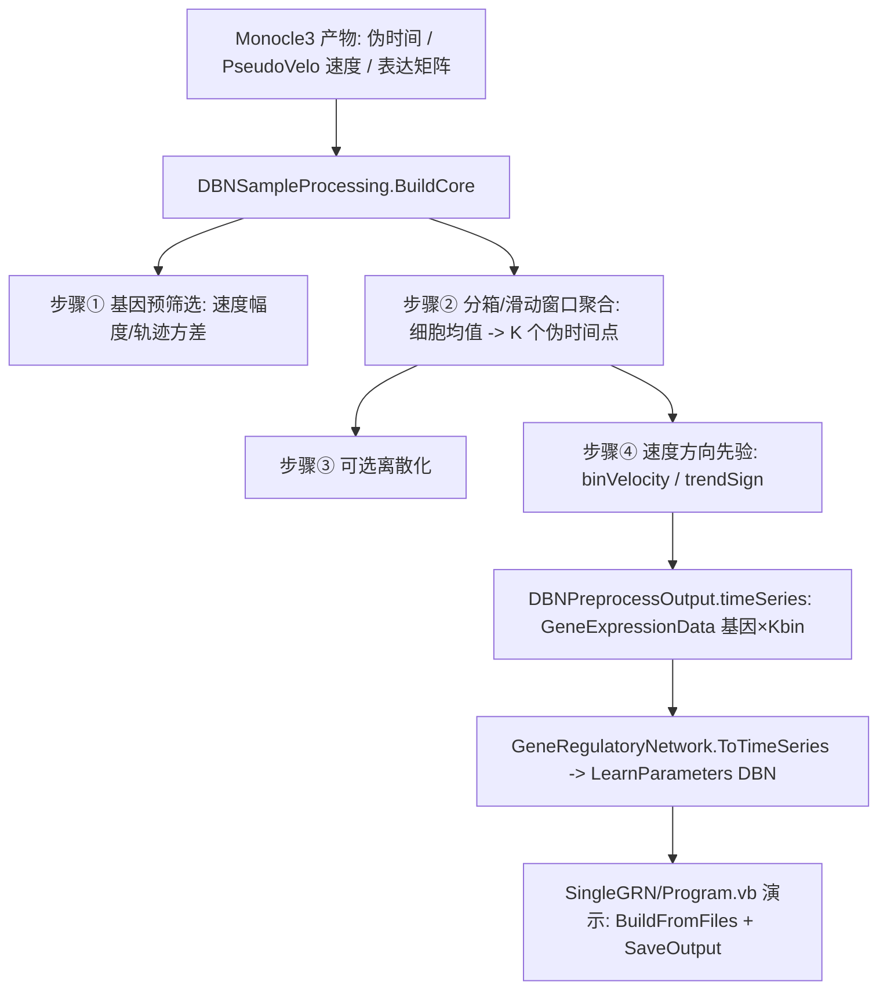

## 用户需求

在 `SingleGRN` 项目中新增一个表达矩阵预处理模块（填入 `SingleGRN\DBNSampleProcessing.vb`），基于 Monocle3 计算得到的伪时间（`SampleInfo.mon_pseudotime`）与 PseudoVelo 计算得到的伪 RNA 速率信息，对原始单细胞表达矩阵做预处理，构造动态贝叶斯网络（DBN，定义在 `GCModeller CellPhenotype\GeneRegulatoryNetwork.vb`）所需的时间序列数据。

方法学遵循 `g:\Erica\src\SingleCell\DBN-PreProcessing.md`：

- 步骤① 基因预筛选：利用 PseudoVelo 伪速率的幅度/趋势，筛选在分化轨迹上有显著动力学变化的基因。
- 步骤② 分箱/滑动窗口聚合：将连续、不等间隔的伪时间排序后，等分为 K 个 bin 或滑动窗口，对每个 bin 内的细胞表达求均值，得到 K 个离散"伪时间点"。
- 步骤③ 离散化（可选）：对表达做分位数多值化，供离散 DBN 使用。
- 步骤④ 伪速率因果方向先验：额外输出每个 bin 的基因伪速度聚合值与各基因沿轨迹趋势方向，供 DBN 作为因果白名单/方向先验。
- 步骤⑤ 分支处理：本次不做，按整体单条线性轨迹分箱。

## 核心功能

- 将"细胞 × 基因"表达矩阵（伪时间连续、无重复）改造成"基因 × K 个 bin"的时间序列矩阵（DBN 的 `GeneExpressionData`），并给每个 bin 打上时间点标签（bin 内平均伪时间）。
- 基因预筛选：依据伪速率幅度剔除动力学不变基因，输出选中/剔除基因清单。
- 速度聚合与趋势方向：输出"基因 × bin"伪速度矩阵与每基因趋势方向（正负号），作为 DBN 因果先验。
- 可选离散化与滑动窗口模式。
- 提供从 Monocle3 内存对象与从导出的 CSV 文件两种入口，并落盘 DBN 时间序列、bin 速度、基因筛选三类 CSV。

## 技术栈

- 语言：VB.NET（.NET 10），与现有 SingleGRN / Monocle3 项目一致。
- 复用依赖（SingleGRN.vbproj 已引用，无需新增）：
- `BNLearn.vbproj` → `SMRUCC.genomics.Analysis.BNLearn.Core.GeneExpressionData`（DBN 目标时间序列结构）。
- `CellPhenotype.vbproj` → DBN `GeneRegulatoryNetwork` 模块（`ToTimeSeries` 按 `TimePoints` 聚合）。
- `..\Monocle3\Monocle3.vbproj` → `Erica.Analysis.SingleCell.Monocle3.Monocle3Result` / `PseudoVelocityResult`。
- `designer-netcore5.vbproj` → `SampleInfo`（解析 `mon_pseudotime`）。
- `dataframework` / `Math.NET5` / `graph` 等（CSV 与数值工具）。

## 实现方案

### 总体策略

在 `SingleGRN\DBNSampleProcessing.vb` 内实现纯函数式预处理模块。核心是把"每个细胞是一个时间点"改造成"K 个代表性伪时间点"，严格按 DBN-PreProcessing.md 的分箱聚合思路，并叠加 PseudoVelo 速度做基因筛选与方向先验。输出直接是 `GeneExpressionData`（基因 × Kbin，TimePoints = bin 中心伪时间），可被 DBN 的 `ToTimeSeries` → `LearnParameters` 直接消费。

### 关键设计决策

1. **数据方向约定**：输入表达矩阵在内部统一规整为"样本（细胞）× 基因"（`exprCellByGene`），伪时间 `pseudotime` 与伪速度 `velocity`（基因 × 细胞，列序=原始样本序）三者样本序一致。输出 `GeneExpressionData.Matrix` 为"基因 × bin"，与 DBN 期望方向一致。
2. **步骤① 基因预筛选**：对每个基因 g 计算 `speedStat(g) = mean(|velocity(g,cell)|)`；若伪速度不可用，则用该基因表达沿伪时间的方差替代。按 `geneSelection`（`"top"` 取速度幅度 top `topGeneFraction`，或 `"threshold"` 取 `> velocityThreshold`；`threshold=NaN` 时自动取速度幅度中位数 × 2）筛选，得到 `selectedGenes` 与 `geneExcluded`。
3. **步骤② 分箱聚合（整体单轨迹）**：

- `method="bins"`：伪时间区间 `[tmin,tmax]` 等分为 `numBins`；样本落入 `bin = clamp(floor((t - tmin)/width), 0, numBins-1)`；bin 表达 = 落入细胞表达均值（仅 selectedGenes）；`binTimePoints(i)` = 该 bin 内细胞平均伪时间。
- `method="sliding"`：按伪时间升序后，以 `windowSize` 为宽、`step` 为步长滑动，每窗口细胞表达均值；`binTimePoints` = 窗口中心伪时间。
- 同步聚合速度：`binVelocity(g,i)` = 该 bin/窗口内细胞速度均值（速度可用时）。

4. **步骤③ 离散化（可选）**：`discretize=True` 时对 bin 矩阵每基因按 `numLevels` 分位数映射为 0..numLevels-1（保留 TimePoints），供离散 DBN。
5. **步骤④ 速度方向先验**：`trendSign(g) = sign(mean over bins of binVelocity(g))`；与 `binVelocity` 一并作为 DBN 因果方向白名单/先验输出。
6. **步骤⑤ 分支**：默认 `groupBy=Nothing` 走全局单轨迹；保留若传入 cluster 标签则逐 group 分箱后拼接的代码分支（本次不启用）。
7. **健壮性**：空值/维度校验；bin 内无样本时回退为最近邻 bin 或置 0 并告警；`velocity` 为空时跳过速度相关统计；性能为 O(基因数 × 细胞数) 线性遍历，HV 基因子集下开销可控。

### 实现要点

- `DBNSampleOptions`：`method="bins"`、`numBins=30`、`windowSize=5`、`step=1`、`geneSelection="top"`、`topGeneFraction=0.3`、`velocityThreshold=NaN`、`discretize=False`、`numLevels=3`、`groupBy=Nothing`。
- `DBNPreprocessOutput`：`timeSeries As GeneExpressionData`、`binVelocity As Double(,)`（基因×bin）、`trendSign As Double()`、`selectedGenes`/`geneExcluded`/`speedStat`/`binLabels`/`binTimePoints`/`sampleNames`/`geneNames`。
- 公开入口：
- `BuildFromMonocle3(result, sampleByGene, geneNames, sampleNames, opts)`：内存对象直连。
- `BuildFromFiles(expressionCsv, pseudotimeCsv, velocityCsv, opts)`：解析 Monocle3 导出物（`02_gene_by_cell.csv` 基因×样本首列基因名、`sampleinfo.csv` 取 `mon_pseudotime` 或 `07_pseudotime.csv`、`pseudovelo_velocity.csv` 基因×细胞首列基因），以样本名为对齐键。
- `SaveOutput(out, dir)`：写出 `dbn_timeseries.csv`（基因×bin，首列基因名）、`dbn_velocity_bins.csv`、`dbn_gene_selection.csv`（gene, selected, speedStat, trendSign）。

## 架构设计



## 目录结构

```
g:\Erica\src\SingleCell\SingleGRN\
├── DBNSampleProcessing.vb   # [MODIFY] 填入预处理模块：DBNSampleOptions / DBNPreprocessOutput / BuildCore / BuildFromMonocle3 / BuildFromFiles / SaveOutput
├── SingleGRN.vbproj        # [MODIFY] 新增 <OutputType>Exe</OutputType> 以运行演示
└── Program.vb              # [NEW] 演示入口：Sub Main 读取 Monocle3 导出 CSV -> BuildFromFiles -> SaveOutput -> 打印摘要
```

## 关键代码结构（示意）

- `Public Class DBNSampleOptions`：`method As String`、`numBins As Integer`、`windowSize As Integer`、`step As Integer`、`geneSelection As String`、`topGeneFraction As Double`、`velocityThreshold As Double`、`discretize As Boolean`、`numLevels As Integer`、`groupBy As Integer()`。
- `Public Class DBNPreprocessOutput`：`timeSeries As GeneExpressionData`、`binVelocity As Double(,)`、`trendSign As Double()`、`selectedGenes As String()`、`geneExcluded As String()`、`speedStat As Double()`、`binLabels As String()`、`binTimePoints As Double()`。
- `Public Function BuildCore(exprCellByGene As Double(,), geneNames As String(), sampleNames As String(), pseudotime As Double(), velocityGeneByCell As Double(,), opts As DBNSampleOptions) As DBNPreprocessOutput`。
- `Public Function BuildFromMonocle3(result As Monocle3Result, sampleByGene As Double(,), geneNames As String(), sampleNames As String(), opts As DBNSampleOptions) As DBNPreprocessOutput`。
- `Public Function BuildFromFiles(expressionCsv As String, pseudotimeCsv As String, velocityCsv As String, opts As DBNSampleOptions) As DBNPreprocessOutput`。
- `Public Sub SaveOutput(out As DBNPreprocessOutput, dir As String)`。