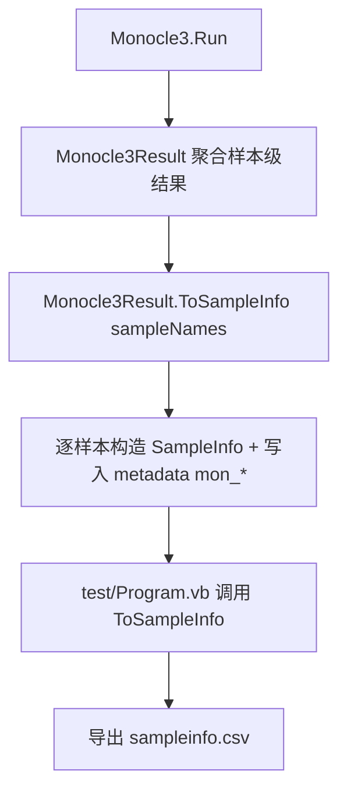

## 用户需求

在 `Monocle3.vb` 的 `Monocle3Result` 结果对象中新增一个函数，将每个样本的分析结果（伪时间、cluster 标签、UMAP/PCA 坐标、全局 Moran's I）写入对应 `SampleInfo` 对象的 `metadata` 字典（统一前缀 `mon_`）；同时在 `Monocle3\test\Program.vb` 中调用该函数并把生成的 `SampleInfo` 集合导出为 CSV。

## 产品概述

为 Monocle3 管线增加"结果回写样本元数据"能力：每个样本对应一个 `SampleInfo`，其 `metadata` 携带该样本的全部样本级分析结论，便于与 GCModeller 实验设计体系对接、下游做分群着色/伪时间排序/可视化。

## 核心功能

- `Monocle3Result.ToSampleInfo(sampleNames)`：依据样本名顺序构建 `SampleInfo()`，并将样本级字段写入 `metadata`。
- 写入字段（前缀 `mon_`）：`mon_pseudotime`、`mon_cluster`、`mon_umap3d_x/y/z`、`mon_umap2d_x/y`、`mon_pca_1..mon_pca_{numPCA}`、`mon_moran_global`。
- 测试程序导出 `sampleinfo.csv`：含 `ID,sample_name` 及全部 `mon_*` 列。

## 技术栈选择

- 语言：VB.NET（.NET 10，与现有 Monocle3 项目一致）
- 复用依赖：`ExperimentDesigner`（`SampleInfo` 类，已在 `Monocle3.vbproj` 与 `test.vbproj` 中 ProjectReference 引用）
- CSV 写出：优先使用 sciBASIC# 标准 CSV 接口 `csv.Write(Of T)(...)`；无 metadata 展开时退回手写列展开（从字典取键）

## 实现方案

在 `Monocle3Result` 内新增实例函数 `ToSampleInfo(sampleNames As String()) As SampleInfo()`：

1. 校验数组长度：若 `pseudotime`/`clusters` 长度与 `sampleNames.Length` 不一致则抛 `ArgumentException`（早失败，避免错位）。
2. 逐样本构造 `SampleInfo`：`ID` 与 `sample_name` 设为样本名；初始化 `metadata` 字典。
3. 写入样本级字段（数值统一用 `ToString("G17")` 保精度；cluster 用 `ToString`）：

- `mon_pseudotime`、`mon_cluster`
- `mon_umap3d_x/y/z`（按 `umap3d(i,0/1/2)`）
- `mon_umap2d_x/y`（按 `umap2d(i,0/1)`）
- `mon_pca_1..mon_pca_{pcaScore.GetLength(1)}`（按 `pcaScore(i,c)`）
- `mon_moran_global`（全局标量，对所有样本相同）

4. 不写入 `clusterGraph`/`pagaGraph`（cluster 级）、`topVariableGenes`（基因级），符合"与样本有关的结果"要求。

测试程序 `Program.vb`：

- 在得到 `result` 后调用 `Dim samples = result.ToSampleInfo(sampleNames)`。
- 导出 `sampleinfo.csv`：优先 `csv.Write(Of SampleInfo)(samples, file)`；若元数据列未自动展开，则手写 `StreamWriter`：首行 `ID,sample_name` + 各 `mon_*` 键（从首个 `metadata` 的键集取并集），逐行填值。
- 在 Summary 段打印 `sample info rows` 计数。

## 实现要点

- 命名空间：实现时确认 `SampleInfo` 命名空间（文件位于 `ExperimentDesigner\Templates`，通常为 `SMRUCC.genomics.Analysis.ExperimentDesigner.Templates`），在 `Monocle3.vb` 顶部新增对应 `Imports`。
- 性能：仅 O(样本数 × 维数) 的线性遍历，且 PCA 维数固定（默认 50），开销可忽略；不引入新依赖或缓存副作用。
- 一致性：键名风格严格采用用户已确认的 `mon_` 前缀；与测试导出列名完全一致。
- 健壮性：函数不修改 `Monocle3Result` 内部状态；`metadata` 初始化为空字典避免 `Nothing` 引用。

## 架构设计



改动范围局限在 `Monocle3.vb`（新增函数）与 `test/Program.vb`（调用+导出），不影响 `TrajectoryOrdering.vb` 既有修复。

## 目录结构

```
g:\Erica\src\SingleCell\Monocle3\
├── Monocle3.vb            # [MODIFY] 在 Monocle3Result 内新增 ToSampleInfo(sampleNames) 函数；顶部补 SampleInfo 命名空间 Imports
└── test\Program.vb       # [MODIFY] 在 Main 中调用 result.ToSampleInfo(sampleNames) 并导出 sampleinfo.csv；补 CSV 写出逻辑
```

## 关键代码结构（示意，非实现体）

- `Public Function ToSampleInfo(sampleNames As String()) As SampleInfo()`
- 输入：样本名数组（顺序与 `pseudotime`/`clusters`/`umap*`/`pcaScore` 行一致）
- 输出：`SampleInfo()`，每个元素 `metadata` 含全部 `mon_*` 键
- 测试导出：文件名 `sampleinfo.csv`，列为 `ID,sample_name,mon_pseudotime,mon_cluster,mon_umap3d_x,mon_umap3d_y,mon_umap3d_z,mon_umap2d_x,mon_umap2d_y,mon_pca_1..,mon_moran_global`