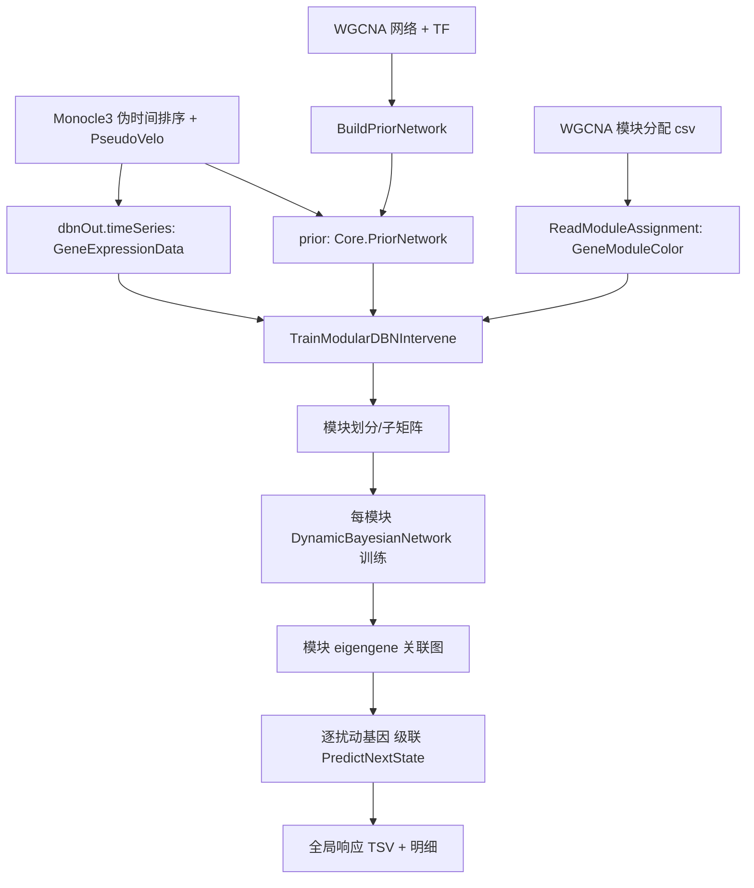

## 用户需求概述

当前针对大型 WGCNA 共表达网络，全局动态贝叶斯网络（DBN）训练与虚拟扰动实验运行极慢。需要基于 WGCNA 共表达模块将时间序列数据分块，逐模块训练独立的"真正动态"DBN 子网络（DynamicBayesianNetwork），再基于模块间相关度构建子网络关联做级联推断，实现全局性虚拟扰动实验，从而大幅提升大规模网络的处理效率。

## 核心功能

- 在 GeneRegulatoryNetwork 模块中新增基于 WGCNA 模块划分的模块化 DBN 训练与全局级联虚拟扰动函数（真正使用 DynamicBayesianNetwork，而非静态 WGCNASubnetworkPipeline）。
- 按 WGCNA 模块（GeneModuleColor）将 GeneExpressionData 时间序列划分为模块基因子块，跳过 grey 模块。
- 每个模块子网络：从合并先验（wgcna + 伪速率）中提取模块内定向边，转为 RegulatoryLink 构建 DynamicBayesianNetwork 拓扑，并使用该模块子矩阵的时间序列离散化学习 CPT 参数。
- 基于模块 eigengene 轨迹相关度构建模块间关联，按关联强度确定跨模块级联推断顺序。
- 对任意显式指定的扰动基因（knockGenes）：定位其所属模块，固定该基因 Low 状态，沿模块关联逐模块调用 PredictNextState 级联推演，汇总所有模块基因的离散状态轨迹。
- 在 Monocle3\test 项目新增测试 demo：串联现有 Monocle3 + PseudoVelo 流程产出伪时间 bin 时间序列与合并先验，读取 WGCNADemo 路径下的模块分配文件，调用新函数执行虚拟扰动并写出结果文件。
- demo 默认限制基因规模与扰动基因数量以避免大盘长时间运行，并在注释中说明如何放大到全量。

## 技术栈

- 语言：VB.NET（.NET 10，与现有项目一致）
- 现有项目：GCModeller sub-system/CellPhenotype（GeneRegulatoryNetwork 模块所在库）、BNLearn（DynamicBayesianNetwork / WGCNA 命名空间）、Monocle3（test 演示项目）
- 数据流复用：GeneExpressionData（基因×伪时间 bin）、Core.PriorNetwork（wgcna + PseudoVelo 合并先验）、RegulatoryLink、DynamicBayesianNetwork

## 实现方案

### 总体策略

在 GeneRegulatoryNetwork 模块中新增一个高内聚的封装函数 `TrainModularDBNIntervene`，按用户选定的"真正动态 DBN 子网络"路线实现：模块划分 → 模块内 DynamicBayesianNetwork 训练 → 模块间关联构建 → 全局级联虚拟扰动。复用模块中已有的 `ToTimeSeries`、`InferEffector`、`BuildRegulatoryLinks` 思路与 BNLearn 的 `DynamicBayesianNetwork`、`WGCNA.ReadModuleAssignment` API，避免重复造轮子。

### 关键技术决策

1. **模块划分**：使用 `WGCNA.ReadModuleAssignment` 读取 GeneModuleColor()，按 moduleColor 分组 geneID（跳过 grey）。对每个模块从 timeSeries 取子矩阵 `GetSubMatrix(genes)`，再用 `ToTimeSeries` 转成 List(Of Dictionary(Of String,Double)) 供 DBN 学习。单基因/空模块跳过（保持与 WGCNASubnetworkPipeline 一致的处理边界）。
2. **模块内 DBN 拓扑**：Core.PriorNetwork 的 Edges（TF/Target/Effector/Confidence）中筛选两端都属于当前模块的边，转成 RegulatoryLink（target_operon=Target，regulate_genes={Target}，effector={Target: Effector}）。复用 GeneRegulatoryNetwork 已有的 InferEffector 规则（正权重=Activator，负=Inhibitor）。若某模块无模块内先验边，则退化为无父节点的拓扑（仅学习自身时序分布），不抛错以保证大网络鲁棒性。
3. **子网络训练**：`New DynamicBayesianNetwork().BuildFromTopology(links)` 后 `LearnParameters(ToTimeSeries(subMatrix))`。利用 DynamicBayesianNetwork 自带的 2TBN + Dirichlet 先验参数学习，天然支持时间序列（需≥2时间点，timeSeries 伪时间 bin 已满足）。
4. **模块间关联（级联推断基础）**：计算每个模块 eigengene 轨迹 = 模块基因在 ToTimeSeries 各时间点上的均值向量；两两模块 eigengene 轨迹 Pearson 相关取绝对值超阈值（默认 0.3）者建立模块关联图（邻接表，权重=|cor|）。级联顺序由关联图拓扑排序决定（简单贪心：按入边少→多，或 BFS 从含扰动基因的模块出发）。
5. **全局级联虚拟扰动**：对 knockGenes 中每个基因 g，找到其所属模块 M0；在 M0 子网络中将 g 固定 Low（敲降），用 PredictNextState 多步推演得到本模块基因状态；将本模块输出基因状态作为相邻模块的父证据（父节点若出现在邻模块则传递），沿模块关联图逐模块级联 PredictNextState，直至所有可达模块收敛或达 dynamicSteps。汇总各模块基因轨迹为 Dictionary(Of String, Double())（Low=0/Med=1/High=2，复用现有 StateToValue 思路）。
6. **结果与导出**：聚合所有扰动基因的全局响应，写出 TSV（gene×perturbation 矩阵 + 每源明细），与 TrainAndIntervene 风格一致；可选 outputDir 为空则不导出。

### 性能与可靠性

- 分而治之：O(单模块规模^2·样本) 远低于全局 O(N^2·样本)，大网络收益显著；模块并行可后续扩展（本阶段串行，保持与现有代码一致，避免过度设计）。
- 仅保留模块基因进入训练，背景基因不参与，缩小全局规模（与 WGCNASubnetworkPipeline 一致）。
- 边界处理：grey 模块跳过、单基因模块跳过、缺失模块内先验边降级、扰动基因不在任何模块时报错提示；所有输入空值检查复用现有 ArgumentNullException 风格。
- 日志复用 VBDebugger/`.info`/`.debug` 风格，避免 log 风暴（模块级摘要而非逐基因打印）。

## 实现注意事项

- GeneRegulatoryNetwork.vb 顶部已 Imports `SMRUCC.genomics.Analysis.BNLearn.DBN` 与 `Core`，无需新增基础引用；需新增 `Imports SMRUCC.genomics.Analysis.BNLearn.Core.WGCNADBN`（或直接使用 WGCNA.ReadModuleAssignment 所在命名空间 `SMRUCC.genomics.Analysis.BNLearn.WGCNA` 按实际定义补 Imports）。
- 新增函数放置在 TrainAndIntervene 之后，保持模块函数聚类；新增内部辅助类型（模块训练结果容器）建议作为 GeneRegulatoryNetwork 模块内的 Private Class/Struct，避免污染公共 API。
- demo 严格复用 Program.vb 已有的 Monocle3.Run → DBNSampleProcessing.BuildFromMonocle3 → VelocityNetwork.BuildVelocityPrior 链路，仅追加模块读取与新函数调用；新增入口 Sub 默认限制 topGeneFraction 与扰动基因数，注释说明全量放大方式。
- 不修改已有 TrainAndIntervene 等函数，保持向后兼容（用户仅要求"新增"函数）。

## 架构设计

### 数据流（mermaid）



### 模块关系

- GeneRegulatoryNetwork（新增函数）依赖：BNLearn.DBN.DynamicBayesianNetwork、BNLearn.WGCNA、BNLearn.Core.PriorNetwork/GeneExpressionData、本模块 ToTimeSeries/InferEffector。
- Monocle3/test demo 依赖：GeneRegulatoryNetwork.TrainModularDBNIntervene、WGCNA.ReadModuleAssignment、现有 Monocle3 链路。

## 目录结构

### 修改/新增文件清单

- G:\GCModeller\src\GCModeller\sub-system\CellPhenotype\GeneRegulatoryNetwork.vb  [MODIFY]
- 新增 TrainModularDBNIntervene（公开函数）：模块划分、模块内 DynamicBayesianNetwork 训练、模块间关联构建、全局级联虚拟扰动、结果导出。
- 新增私有辅助：模块训练结果容器类（模块名/子网络/基因表/索引）、模块内边提取为 RegulatoryLink、模块 eigengene 轨迹计算、模块关联图构建、单扰动基因级联推演。
- 顶部按需补 `Imports SMRUCC.genomics.Analysis.BNLearn.WGCNA`（按 GeneModuleColor 实际命名空间）。
- G:\Erica\src\SingleCell\Monocle3\test\ModuleDBNDemo.vb  [NEW]
- 演示入口：复用 Monocle3 流程产出 dbnOut + prior；ReadModuleAssignment 读取 K:\hsa\WGCNA_output-demo\gene_module_assignment.csv 与表达矩阵；调用 TrainModularDBNIntervene；写出结果目录（复用 Program.vb 的 ExportSampleInfo/ExportVelocity 风格可选）。限制基因规模与扰动基因数，注释说明全量放大方式。
- Program.vb 中新增 `Sub Main` 分支或 `RunModuleDemo` 调用（[MODIFY] 轻量接入，保持现有 RunModel/RunDemo1 不变）。
- G:\Erica\src\SingleCell\Monocle3\test\test.vbproj  [MODIFY]
- 确认 Compile 包含新增 ModuleDBNDemo.vb（默认 glob 包含 test 目录下 *.vb，通常无需改动；若使用显式列表则补充）。

## 关键代码结构（接口级）

```
' GeneRegulatoryNetwork 模块新增公开函数签名
Public Function TrainModularDBNIntervene(
    timeSeries As Core.GeneExpressionData,
    modules As GeneModuleColor(),
    prior As Core.PriorNetwork,
    TF As String(),
    knockGenes As String(),
    Optional dynamicSteps As Integer = 10,
    Optional crossModuleCorThreshold As Double = 0.3,
    Optional outputDir As String = Nothing
) As (responses As Dictionary(Of String, Double()()),
      moduleNets As Dictionary(Of String, DynamicBayesianNetwork))
```