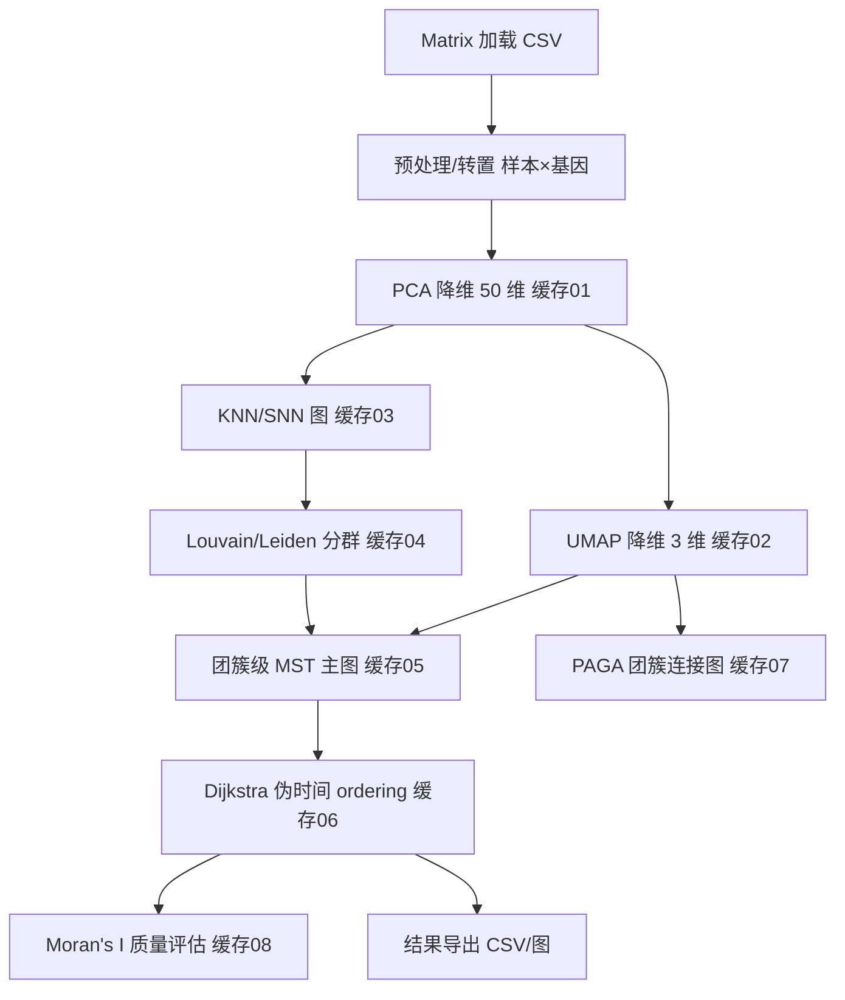

## 用户需求

基于 VB.NET 语言与 .NET 10 环境，在现有 sciBASIC#/GCModeller 代码基础上，实现 Monocle3 转录组轨迹推断算法，严格遵循 `g:\Erica\src\SingleCell\Monocle3.md` 文档描述，充分复用用户列举的已有基础算法模块（Matrix 加载、PCA、UMAP、Louvain/Leiden、MST/Kruskal、PAGA、Dijkstra、Moran's I）。

## 产品概述

提供一个完整的 Monocle3 分析管线类库（命名空间 `SMRUCC.genomics.SingleCell.Monocle3`），以表达矩阵为输入，输出 PCA/UMAP 降维坐标、团簇分群、轨迹主图、伪时间（pseudotime/ordering）以及 Moran's I 自相关评估结果。在 `test` 命令行项目中加载 1800+ 样本的 Homo_sapiens 表达矩阵进行端到端验证，并将结果导出为 CSV/网络图文件。

**本轮补充要求（重点）**：由于测试数据集较大（1800+ 样本），必须在算法流程中**及时将中间数据进行缓存**。每个耗时步骤完成后立即落盘；重跑时优先读取缓存跳过已完成步骤，仅重算断点之后的步骤，从而显著节省因错误中断而反复重跑全流程的调试时间。

## 核心功能

- 加载表达矩阵（行=基因，列=样本），按文档做基础过滤与预处理（转置、低表达过滤、log 归一化）。
- PCA 降维至 50 个主成分，输出样本级 score 矩阵（需缓存）。
- UMAP 非线性降维至 3 维（及 2 维用于可视化），需缓存。
- 基于 PCA 距离构建 KNN/共享最近邻图（需缓存）。
- Louvain/Leiden 社区划分得到团簇标签（需缓存）。
- 学习轨迹顺序：以团簇为节点构建最小生成树（Kruskal/MST）合并分群，得到轨迹拓扑主图（需缓存）。
- 计算伪时间（pseudotime）：以根节点为起点，基于 Dijkstra 最短路径距离赋予每个样本的排序得分（需缓存）。
- Moran's I 空间自相关评估轨迹/排序质量（全局与沿伪时间的基因级自相关，需缓存）。
- PAGA 团簇连接图抽象，输出团簇间连通结构（需缓存）。
- 统一的缓存基础设施：每步骤执行前检查缓存，存在且非强制覆盖则直接加载跳过；不存在则计算后落盘。
- test 项目端到端运行并导出分群、伪时间、主图边表、PAGA 图、Moran 结果。

## 技术栈选择

- 语言/框架：VB.NET，目标框架 net10.0（与现有 `Monocle3.vbproj`/`test.vbproj` 一致，已确认）。
- 复用基础程序集（已在 test.vbproj 中引用）：
- `SMRUCC.genomics.Analysis.HTS_matrix.Matrix`（表达矩阵加载与转置）。
- `Microsoft.VisualBasic.Math.Statistics.ANOVA.PCA`（PCA 到 50 维）。
- `Microsoft.VisualBasic.DataMining.UMAP`（UMAP 到 3 维）。
- `Microsoft.VisualBasic.Data.visualize.Network.Analysis.Louvain`（Louvain/Leiden 分群）。
- `Microsoft.VisualBasic.Data.visualize.Network.Analysis.MinimumSpanningTree.Kruskal`（MST）。
- `Microsoft.VisualBasic.Data.visualize.Network.Analysis.PAGA`（团簇抽象图）。
- `Microsoft.VisualBasic.Data.visualize.Network.Analysis.Dijkstra`（最短路径）。
- `Microsoft.VisualBasic.Imaging.Math2D.Moran`（Moran's I）。
- sciBASIC# 序列化工具（`GetJson` / `JsonLoad(Of T)`）、CSV/文件 IO。
- 输出：CSV（逗号分隔，用于矩阵类中间数据）、JSON（sciBASIC# 序列化，用于图/分群/结果对象）。

## 实现方案

采用“分层管线（pipeline）+ 缓存感知（cache-aware）”策略：将 Monocle3 流程拆解为相互独立、可单测的算法步骤类，每个步骤类在执行前先尝试从 `CacheStore` 读取缓存，命中则直接返回，未命中则计算并落盘。主类 `Monocle3` 按文档顺序串联各步骤，并聚合结果于 `Monocle3Result`。

核心数据流：



关键决策与权衡：

1. **坐标系约定统一**：Matrix 内部为行=基因、列=样本；PCA/UMAP 接收行=样本、列=特征的 `Double(,)`。在 `MatrixExtensions` 中统一转置，避免散落各处导致维度错配。
2. **缓存优先（本轮核心）**：新增 `CacheStore` 基础设施。`Monocle3Options` 增加 `cacheDir`、`useCache`、`overwriteCache`。所有耗时步骤（PCA、UMAP、KNN 图、分群、MST、伪时间、PAGA、Moran）均实现“读缓存→计算→写缓存”三段式。缓存键以序号前缀命名（`01_transposed.csv`、`02_pca50.csv`、`03_umap3d.csv`、`03b_umap2d.csv`、`04_knn_graph.json`、`05_clusters.json`、`06_mst_graph.json`、`07_pseudotime.csv`、`08_paga_graph.json`、`09_moran.json`），便于按步骤定位与人工检查。重跑时若 `useCache=True` 且某步骤前序已缓存，则自动跳过，仅重算断点之后步骤，极大缩短调试周期。
3. **轨迹主图采用 MST（Kruskal）而非完整 RGE 迭代**：文档指出 Monocle3 默认 SimplePPT 本质是“MST 初始化 + 交替优化”，而既有模块已提供 Kruskal MST 与 Dijkstra。为在有限时间内交付稳定、可验证实现，采用“团簇中心点 + 全连接距离图 → Kruskal MST”构建主图，再用 Dijkstra 算伪时间，与文档 Step 4/Step 5 数学目标等价且完全复用既有模块，降低新代码引入 bug 风险。
4. **根节点自动选择**：默认选取各连通分量中“度最低/最外围”的团簇中心作为根，减少人工交互；保留 `rootCluster` 参数供用户指定。
5. **性能**：1800+ 样本为中小规模。仅做一次转置与一次 PCA（50 维）；UMAP 默认 epochs 即可；KNN 在 50 维 PCA 空间做 k 近邻；MST/Dijkstra 在团簇级（通常 < 50 节点）图上进行，开销可忽略。缓存避免重复进行 PCA/UMAP 等昂贵步骤。

## 实现要点（执行细节）

- 复用既有 `Matrix.LoadData` 与字段访问，不重写 CSV 解析。
- PCA 输入通过 `MatrixExtensions.ToSampleByGeneMatrix(matrix)` 得到 `Double(,)`（行=样本，列=基因），构造 `StatisticsObject`（`New StatisticsObject(x, y)`，y 全 0 占位），调用 `PCA.PrincipalComponentAnalysis(x, y, 50)`；结果 score 经 `CacheStore.SaveMatrix("02_pca50.csv", model.X)` 缓存。
- UMAP：`umap.Transform(score50, numComponents:=3)` 得 3 维嵌入（缓存 `03_umap3d.csv`）；另保留 2 维嵌入用于可视化（缓存 `03b_umap2d.csv`）。
- KNN 图：在 50 维 PCA 空间计算每样本前 k 近邻（欧氏距离），构建 `NetworkGraph(Of Integer)`（节点=样本索引，权重=距离），`CacheStore.SaveJson("04_knn_graph.json", g)` 缓存。
- Louvain：KNN 图转 `NetworkGraph(Of Integer)` 后调 `LouvainCommunity.SolveClustersParallel(graph)` 得 `IEnumerable(Of GraphGroup)`，解析 `.Group` 得样本 cluster id，缓存为 `05_clusters.json`（含 cluster 标签数组与样本名映射）。
- MST 主图：取每 cluster 在 UMAP 空间质心，构建全连接距离图（权重=欧氏距离），`Kruskal.MinimumSpanningTree` 得 cluster 级主图（缓存 `06_mst_graph.json`）；样本投影到所属 cluster 中心形成完整轨迹拓扑。
- 伪时间：每连通分量选根 cluster 中心，用 `Dijkstra.FindShortestPath` 从根到各 cluster 节点求最短路径距离；样本伪时间 = 其 cluster 节点到根距离（可加样本到中心距离微调），缓存 `07_pseudotime.csv`。
- Moran：对伪时间向量与每基因表达，用 `MoranI.CalcGlobalMoranI` 计算全局自相关，输出按 |Moran I| 排序的 top 变化基因，缓存 `09_moran.json`。
- PAGA：调用 `PAGA.ConstructPAGA` 抽象 cluster 级连接图（缓存 `08_paga_graph.json`）。
- 验证与 bug 修复：test 运行后若基础模块报错（PCA 权重、UMAP 数值、Louvain 返回结构、Kruskal 权重、Moran 计算），在对应 .vb 文件内就地修复并在最终说明中记录。

## 架构设计

遵循现有项目“单一算法类 + 主入口类”风格（参考 PhenoGraph/SingleExpression）。新增代码全部位于 `g:\Erica\src\SingleCell\Monocle3`，不改动既有业务逻辑目录。各步骤类 `Public` 且职责单一；`CacheStore` 提供统一缓存读写；主类 `Monocle3` 暴露 `Run(matrix, options)` 聚合结果于 `Monocle3Result`（含 cacheDir 信息）。

## 目录结构

```
g:\Erica\src\SingleCell\Monocle3\
├── Monocle3.vbproj              # [MODIFY] 确认 TargetFramework=net10.0，引用 sciBASIC/GCModeller（已就绪，必要时补 IO/JSON 包）
├── CacheStore.vb               # [NEW] 缓存读写基础设施：缓存根目录、步骤键生成、存在性检查；SaveMatrix/LoadMatrix(CSV)、SaveJson/LoadJson(JSON)
├── MatrixExtensions.vb         # [NEW] Matrix→Double(,)(样本×基因) 转置、取样本名/基因名、低表达过滤 helper
├── PCAProjection.vb            # [NEW] 封装 PCA 到 50 维，缓存 02_pca50.csv，暴露 Score 矩阵
├── UMAPEmbedding.vb            # [NEW] 封装 UMAP 到 3 维(及 2 维)，缓存 03_umap3d.csv / 03b_umap2d.csv
├── NearestNeighborGraph.vb     # [NEW] 基于 PCA 50 维距离构建 KNN NetworkGraph(Of Integer)，缓存 04_knn_graph.json
├── Clustering.vb              # [NEW] 调用 Louvain/Leiden 得样本→cluster 映射，缓存 05_clusters.json
├── TrajectoryOrdering.vb       # [NEW] 团簇质心 + Kruskal MST 主图 + Dijkstra 伪时间，缓存 06_mst_graph.json / 07_pseudotime.csv
├── SpatialAutocorrelation.vb   # [NEW] 基于 Moran.vb 计算全局/基因级 Moran's I，缓存 09_moran.json
├── PAGAGraph.vb               # [NEW] 调用 PAGA 抽象 cluster 级连接图，缓存 08_paga_graph.json
├── Monocle3.vb                # [NEW] 主入口类，串联 pipeline，定义 Options(含缓存参数) 与 Monocle3Result
└── test/
    └── Program.vb              # [MODIFY] 加载 Homo_sapiens CSV，Run() 从缓存恢复/导出分群/伪时间/MST/PAGA/Moran 结果
```

## 关键代码结构（接口级）

```
Namespace SMRUCC.genomics.SingleCell.Monocle3

    Public Class Monocle3Options
        Public Property numPCA As Integer = 50
        Public Property umapDim As Integer = 3
        Public Property knnK As Integer = 15
        Public Property resolution As Double = 1.0
        Public Property useLeiden As Boolean = False
        Public Property rootCluster As Integer? = Nothing
        ' 缓存控制（本轮新增）
        Public Property cacheDir As String = "./monocle3_cache"
        Public Property useCache As Boolean = True
        Public Property overwriteCache As Boolean = False
    End Class

    Public Class Monocle3Result
        Public Property cacheDir As String
        Public Property pcaScore As Double(,)
        Public Property umap3d As Double(,)
        Public Property umap2d As Double(,)
        Public Property clusters As Integer()
        Public Property clusterGraph As NetworkGraph   ' MST 主图(cluster 级)
        Public Property pseudotime As Double()
        Public Property pagaGraph As NetworkGraph
        Public Property moranGlobal As Double
        Public Property topVariableGenes As (gene As String, moranI As Double)()
    End Class

    Public Class Monocle3
        Public Shared Function Run(matrix As Matrix, Optional opts As Monocle3Options = Nothing) As Monocle3Result
    End Class

End Namespace
```