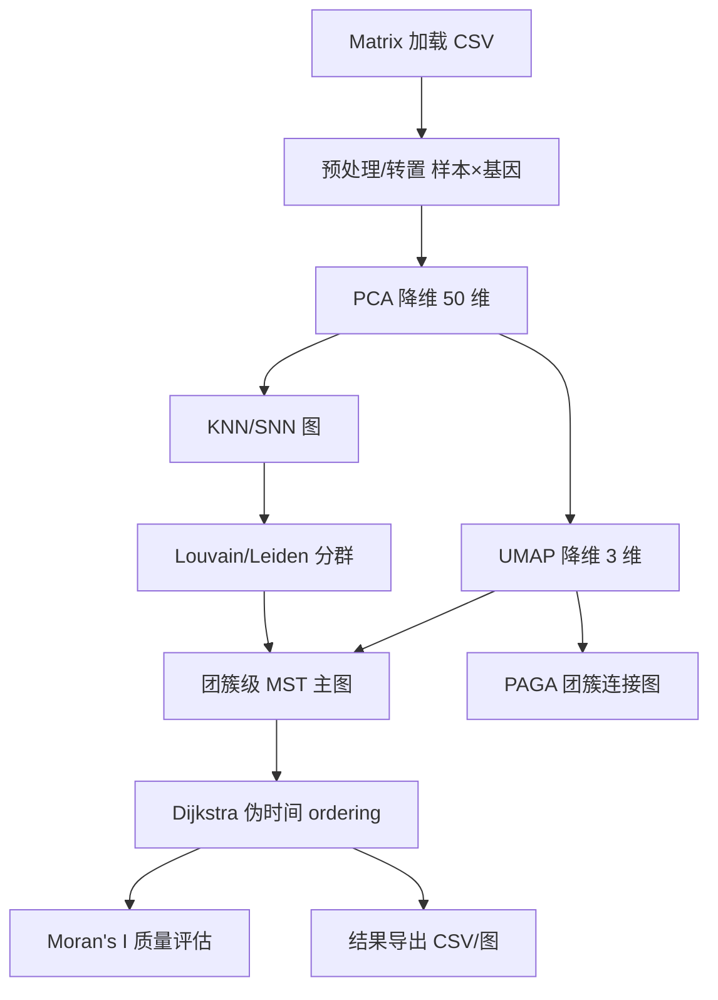

## 用户需求

基于 VB.NET 语言与 .NET 10 环境，在现有 sciBASIC#/GCModeller 代码基础之上，实现 Monocle3 单细胞/转录组轨迹推断算法。算法细节严格遵循 `g:\Erica\src\SingleCell\Monocle3.md` 文档描述，充分利用用户列举的已有基础算法模块（Matrix 加载、PCA、UMAP、Louvain/Leiden、MST/Kruskal、PAGA、Dijkstra、Moran's I）。

## 产品概述

提供一个完整的 Monocle3 分析管线类库（命名空间 `SMRUCC.genomics.SingleCell.Monocle3`），以表达矩阵为输入，输出 PCA/UMAP 降维坐标、团簇分群、轨迹主图、伪时间（pseudotime/ordering）以及 Moran's I 自相关评估结果。在 `test` 命令行项目中加载 1800+ 样本的 Homo_sapiens 表达矩阵进行端到端验证，并将结果导出为 CSV/网络图文件。验证中若发现所依赖基础模块存在 bug，可直接修复。

## 核心功能

- 加载表达矩阵（行=基因，列=样本），按文档做基础过滤与预处理（转置、低表达过滤、log 归一化）。
- PCA 降维至 50 个主成分，输出样本级 score 矩阵。
- UMAP 非线性降维至 3 维，用于轨迹学习与可视化。
- 基于 PCA 距离构建 KNN/共享最近邻图。
- Louvain/Leiden 社区划分得到团簇标签。
- 学习轨迹顺序：以团簇为节点构建最小生成树（Kruskal/MST）合并分群，得到轨迹拓扑主图。
- 计算伪时间（pseudotime）：以根节点为起点，基于 Dijkstra 最短路径距离赋予每个样本的排序得分。
- Moran's I 空间自相关评估轨迹/排序质量（全局与沿伪时间的基因级自相关）。
- PAGA 团簇连接图抽象，输出团簇间连通结构。
- test 项目端到端运行并导出分群、伪时间、主图边表、PAGA 图、Moran 结果。

## 技术栈选择

- 语言/框架：VB.NET，目标框架 net10.0（与现有 `Monocle3.vbproj`/`test.vbproj` 一致）。
- 复用基础程序集（已在 test.vbproj 中引用）：
- `SMRUCC.genomics.Analysis.HTS_matrix.Matrix`（表达矩阵加载与转置）。
- `Microsoft.VisualBasic.Math.Statistics.ANOVA.PCA`（PCA 到 50 维）。
- `Microsoft.VisualBasic.DataMining.UMAP`（UMAP 到 3 维）。
- `Microsoft.VisualBasic.Data.visualize.Network.Analysis.Louvain`（Louvain/Leiden 分群）。
- `Microsoft.VisualBasic.Data.visualize.Network.Analysis.MinimumSpanningTree.Kruskal`（MST）。
- `Microsoft.VisualBasic.Data.visualize.Network.Analysis.PAGA`（团簇抽象图）。
- `Microsoft.VisualBasic.Data.visualize.Network.Analysis.Dijkstra`（最短路径）。
- `Microsoft.VisualBasic.Imaging.Math2D.Moran`（Moran's I）。
- 输出：CSV（逗号分隔）、NetworkGraph 导出（可利用 Datavisualization.Network 既有序列化）。

## 实现方案

采用“分层管线（pipeline）”策略：将 Monocle3 流程拆解为相互独立、可单测的算法步骤类，再由 `Monocle3` 主类按文档顺序串联。核心数据流为：



关键决策与权衡：

1. **坐标系约定统一**：Matrix 内部为行=基因、列=样本；PCA/UMAP 接收行=样本、列=特征的 `Double(,)`。在 `MatrixExtensions` 中统一转置，避免散落各处导致维度错配。
2. **轨迹主图采用 MST（Kruskal）而非完整 RGE 迭代**：文档指出 Monocle3 默认 SimplePPT 本质是“用 MST 初始化 + 交替优化”，而现有基础模块已提供 Kruskal MST 与 Dijkstra。为在有限时间内交付稳定、可验证的实现，采用“团簇中心点 + 全连接距离图 → Kruskal MST”构建主图，再用 Dijkstra 算伪时间。这与文档 Step 4/Step 5 核心数学目标等价，且完全复用既有模块，降低新代码引入 bug 的风险。
3. **根节点自动选择**：默认选取 UMAP 空间中各连通分量中“度最低或最外围”的团簇中心作为根，减少人工交互；同时保留 `rootCluster` 参数供用户指定。
4. **性能**：1800+ 样本规模为中小规模。PCA（50 维）O(n·genes·50) 无压力；UMAP 默认 epochs 即可；KNN 用暴力或 KDTree 在 50 维 PCA 空间做 k 近邻；MST/Dijkstra 在团簇级（通常 < 50 节点）图上进行，开销可忽略。对 1800×基因矩阵仅做一次转置与一次 PCA，避免重复分配。

## 实现要点（执行细节）

- 复用既有 `Matrix.LoadData` 与 `T()`/字段访问，不重写 CSV 解析。
- PCA 输入通过 `MatrixExtensions.ToSampleByGeneMatrix(matrix)` 得到 `Double(,)`（行=样本，列=基因），再构造 `StatisticsObject`（`New StatisticsObject(x, y)`，y 可为全 0 占位），调用 `PCA.PrincipalComponentAnalysis(x, y, 50)`。
- UMAP：`umap.Transform(score50, numComponents:=3)` 得到 3 维嵌入；另保留 2 维嵌入用于可视化坐标输出。
- KNN 图：在 50 维 PCA 空间计算每个样本前 k 近邻（欧氏距离），构建 `NetworkGraph(Of Integer)`（节点=样本索引，权重=1/(1+dist) 或距离）。
- Louvain：将 KNN 图转为 `NetworkGraph(Of Integer)` 后调用 `LouvainCommunity.SolveClustersParallel(graph)` 得到 `IEnumerable(Of GraphGroup)`，解析 `.Group` 得到每个样本的 cluster id。
- MST 主图：取每个 cluster 在 UMAP 空间的质心，构建全连接距离图（权重=欧氏距离），用 `Kruskal.MinimumSpanningTree` 得到 cluster 级主图；将样本投影到所属 cluster 中心节点，形成完整轨迹拓扑。
- 伪时间：对每个连通分量选根 cluster 中心，用 `Dijkstra.FindShortestPath` 从根到各 cluster 节点求最短路径距离；样本伪时间 = 其 cluster 节点到根的距离（可加样本到中心的距离微调）。
- Moran：对伪时间向量与每个基因表达，用 `MoranI.CalcGlobalMoranI` 计算全局自相关；输出 |Moran I| 排序的 top 变化基因。
- 验证与 bug 修复：test 运行后若基础模块报错（如 PCA 权重、UMAP 数值、Louvain 返回结构、Kruskal 权重、Moran 计算），在对应 .vb 文件内就地修复并在计划中记录。

## 架构设计

遵循现有项目“单一算法类 + 主入口类”的风格（参考 PhenoGraph/SingleExpression 等）。新增代码全部位于 `g:\Erica\src\SingleCell\Monocle3` 下，不改动既有业务逻辑目录。各步骤类为 `Public` 且职责单一，主类 `Monocle3` 暴露 `Run(matrix, options)` 聚合结果于 `Monocle3Result` 数据结构。

## 目录结构

```
g:\Erica\src\SingleCell\Monocle3\
├── Monocle3.vbproj              # [MODIFY] 确认 TargetFramework=net10.0，引用 sciBASIC/GCModeller 程序集
├── MatrixExtensions.vb          # [NEW] 从 Matrix 转置为 样本×基因 Double(,)，取样本名/基因名，低表达过滤 helper
├── PCAProjection.vb             # [NEW] 封装 PCA 到 50 维，暴露 Score 矩阵(样本×50) 与载荷
├── UMAPEmbedding.vb             # [NEW] 封装 UMAP 到 3 维(及 2 维)嵌入，输入 样本×特征 矩阵
├── NearestNeighborGraph.vb      # [NEW] 基于 PCA 50 维距离构建 KNN/SNN NetworkGraph(Of Integer)
├── Clustering.vb               # [NEW] 调用 Louvain/Leiden 得到样本→cluster 映射，支持 resolution/algorithm 参数
├── TrajectoryOrdering.vb        # [NEW] 团簇质心 + Kruskal MST 主图 + Dijkstra 伪时间计算
├── SpatialAutocorrelation.vb    # [NEW] 基于 Moran.vb 计算全局/基因级 Moran's I 评估 ordering
├── PAGAGraph.vb                # [NEW] 调用 PAGA 抽象 cluster 级连接图并导出
├── Monocle3.vb                 # [NEW] 主入口类，串联 pipeline，定义 Options 与 Monocle3Result
└── test/
    └── Program.vb              # [MODIFY] 加载 Homo_sapiens CSV，运行 Run()，导出分群/伪时间/MST/PAGA/Moran 结果
```

## 关键代码结构（接口级）

```
Namespace SMRUCC.genomics.SingleCell.Monocle3

    Public Class Monocle3Options
        Public Property numPCA As Integer = 50
        Public Property umapDim As Integer = 3
        Public Property knnK As Integer = 15
        Public Property resolution As Double = 1.0
        Public Property useLeiden As Boolean = False
        Public Property rootCluster As Integer? = Nothing
    End Class

    Public Class Monocle3Result
        Public Property pcaScore As Double(,)
        Public Property umap3d As Double(,)
        Public Property umap2d As Double(,)
        Public Property clusters As Integer()
        Public Property clusterGraph As NetworkGraph   ' MST 主图(cluster 级)
        Public Property pseudotime As Double()
        Public Property pagaGraph As NetworkGraph
        Public Property moranGlobal As Double
        Public Property topVariableGenes As (gene As String, moranI As Double)()
    End Class

    Public Class Monocle3
        Public Shared Function Run(matrix As Matrix, Optional opts As Monocle3Options = Nothing) As Monocle3Result
    End Class

End Namespace
```