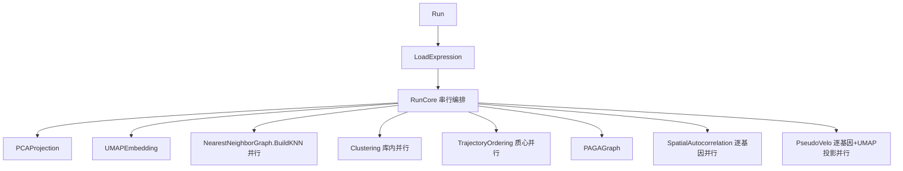

## 用户需求

对 `Monocle3\Monocle3.vb` 项目（VB.NET / sciBASIC# 生态）的算法代码进行审查与并行化性能优化，优化目标为算法计算性能，不改变算法语义与缓存协议，不修改外部 sciBASIC# 库。

## 产品概述

在现有 Monocle3 单细胞轨迹推断管线上，对自写的密集计算循环（KNN 图构建、PseudoVelo 伪速度、空间自相关、矩阵预处理与转置等）引入轻量级并行化（Parallel.For / PLINQ），使多核 CPU 得到利用，缩短端到端运行时间。结果数值需与串行版本一致。

## 核心特征

- KNN 图构建：将样本级距离计算与 Top-K 近邻选取并行化，采用"并行生成候选边、统一去重"模式消除共享 HashSet 竞争。
- PseudoVelo 逐基因：将逐基因排序/平滑/求导并行化，velocity 矩阵按基因私有区间写回。
- PseudoVelo UMAP 投影：将逐细胞余弦相似度加权投影并行化，内部累加器线程私有。
- 空间自相关：逐基因 Moran's I 计算并行化，结果数组按索引写回。
- 预处理与转置：低表达过滤、高变基因方差、矩阵转置/重排循环并行化。
- 轨迹质心归并：样本到 cluster 累加采用线程私有累加器后合并，保证确定性。
- 保留全部步骤缓存落盘与命中逻辑，新增并行开关选项，默认开启，关闭时回退串行以验证一致性。

## 技术栈

- 语言/框架：VB.NET（.NET，sciBASIC# / GCModeller 生态），项目文件 `Monocle3.vbproj`
- 并行原语：`System.Threading.Tasks.Parallel`（Parallel.For）+ PLINQ（`AsParallel().ForAll` / `Select`）
- 共享状态处理：线程私有累加器（local state）或"并行收集 → 主线程合并/去重"
- 数值一致：避免浮点累加顺序依赖；KNN 去重改用全局边表归并而非并发 HashSet

## 实现方案

### 总体策略

在 `RunCore` 串联的 8 个步骤中，仅对 Monocle3 项目内自写的密集计算循环做局部并行化，不触碰 `PCA.PrincipalComponentAnalysis` / `Umap.Step` 等库内部实现。`Clustering` 已通过 `louvain.SolveClustersParallel()` 库内并行，保持不变。每个并行化点采用"无共享写 → 私有区间写回"或"并行生成 → 统一规约"模式，确保输出与串行逐 bit 一致（浮点归并顺序固定）。

### 关键技术决策与权衡

1. **KNN（最大热点，O(n²·d)）**：外层 `For i` 每样本的 `dist(j)` 与 Top-K 完全独立。改用 `Parallel.For(i=0..n-1)`，每线程产出该样本的候选边列表（局部 List），循环结束后 `List.AddRange` 到全局边表，再按 `min-max` 键去重。避免原 `HashSet seen` 的线程竞争与不确定性。Top-K 排序开销小，保留 `OrderBy` 即可。
2. **PseudoVelo 逐基因（O(genes×cells)）**：`For g` 中 `ySorted/smoothed/vSorted` 均为局部数组，尾部 `velocity(g, order(i)) = vSorted(i)` 为目标矩阵第 g 行不同列——按"基因 g 对应 velocity 第 g 行"分配，天然无写冲突，直接 `Parallel.For(g)`。
3. **PseudoVelo.ProjectToUMAP（O(n²·d)）**：外层 `For i` 每细胞累加 `sumX/sumY/sumW` 为局部变量，仅写 `velUMAP(i, *)` 第 i 行，无冲突，`Parallel.For(i)`。
4. **SpatialAutocorrelation 逐基因**：`moranOfGene(g)` 第 g 位独立，`Parallel.For(g)`，内部 `expr` 局部数组，确认浮点顺序一致。
5. **MatrixExtensions**：低表达过滤 `For g`、HVG 方差 `For j`、转置 `For i`/`For j` 均为列/行独立，使用 `Parallel.For`；`ToRowVectors` 行独立可并行。
6. **TrajectoryOrdering 质心归并**：`For s` 把样本累加到 `centroid(ci,*)`，跨线程竞争。改用 `Parallel.For(s)` + 线程本地 `centroidLocal`（副本），循环后累加到共享 `centroid`；或用 `centroid` 按 cluster 分块（cluster 数 k 小，按 cluster 索引原子加）。本计划采用 `Parallel.For` + 线程私有累加后规约，避免 lock。
7. **并行开关**：在 `Monocle3Options` 新增 `parallelEnabled As Boolean = True`。各并行点用 `If opts.parallelEnabled Then Parallel.For(...) Else For ...` 包裹，便于回退串行验证一致性，不改变默认行为。

### 性能与可靠性

- KNN 与 ProjectToUMAP 为 O(n²) 级，是端到端最大收益点；在 1800+ 样本上理论可线性加速至核数（受内存带宽限制）。
- PseudoVelo 逐基因、Moran 逐基因在基因数（~2000）下可良好扩展。
- 风险：KNN 去重若用并发集合会引入不确定性；统一规约避免该问题。各并行写均按目标索引/行私有，无数据竞争。
- 验证：关闭 `parallelEnabled` 与开启时，对同一输入比对缓存产物（CSV/JSON），应完全一致。

## 实施说明

- 仅改 `Monocle3\` 内文件，不改 sciBASIC# 库；新增 `Imports System.Threading.Tasks`。
- 保留 `CacheStore` 各步骤独立缓存；并行仅作用于单步骤内部，缓存键与协议不变。
- 日志沿用 `Console.WriteLine`；并行循环内不打印进度（避免交错），外层打印一次耗时。
- 统一在文件头加 `Imports System.Threading.Tasks`；`Parallel.For` 上界用 `n`（不含）即 `0 To n - 1`，用 `Parallel.For(0, n, Sub(i) ...)`。
- 浮点：KNN 权重 `1/(1+d)`、质心均值等归并顺序固定，不跨线程累加同一标量以避免浮点顺序差异。

## 架构设计

维持现有分层：入口 `Run`/`RunCore`（串行编排）→ 各 `Algorithm/*` 步骤自包含。并行化是步骤内部实现细节，对外接口、缓存协议、返回类型均不变。新增并行开关选项为唯一新增配置面。

### 系统架构（并行化点示意）



## 目录结构

```
Monocle3/
├── Monocle3Options.vb              # [MODIFY] 新增 parallelEnabled 选项（默认 True），作为并行开关
├── Algorithm/
│   ├── Graph/
│   │   └── NearestNeighborGraph.vb # [MODIFY] BuildKNN 外层 For i 改 Parallel.For；并行生成候选边，循环后统一去重
│   ├── MatrixExtensions.vb         # [MODIFY] ToSampleByGeneMatrix 过滤/转置、SelectHighlyVariableGenes 方差循环并行化（Parallel.For）
│   ├── SpatialAutocorrelation.vb   # [MODIFY] Evaluate 逐基因 Moran's I 循环改 Parallel.For，结果按索引写回
│   └── TrajectoryOrdering.vb       # [MODIFY] Learn 质心归并 For s 改 Parallel.For + 线程私有累加规约；不可达兜底保持串行（k 小）
├── PseudoVelo.vb                   # [MODIFY] Compute 逐基因 For g 改 Parallel.For；ProjectToUMAP 逐细胞 For i 改 Parallel.For（局部累加）
```

## 关键代码结构（并行化模式示意）

```
' NearestNeighborGraph.BuildKNN：并行生成 + 统一去重
Dim localEdges As New Concurrent.ConcurrentBag(Of EdgeData)()
Parallel.For(0, n, Sub(i)
    Dim dist(n - 1) As Double
    ' ... 计算 dist(j) 与 Top-K ...
    For Each j In order
        localEdges.Add(New EdgeData With {.u = Math.Min(i, j), .v = Math.Max(i, j), .weight = 1.0 / (1.0 + dist(j))})
    Next
End Sub)
' 主线程按 min-max 键去重后 Build

' PseudoVelo.Compute：逐基因并行，velocity(g,*) 行私有
Parallel.For(0, nGenes, Sub(g)
    ' ... ySorted/smoothed/vSorted 局部 ...
    For i = 0 To nCells - 1
        velocity(g, order(i)) = vSorted(i)   ' g 行不同列，无冲突
    Next
End Sub)
```