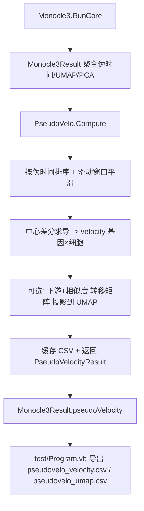

## 用户需求

在现有 `Monocle3` 项目基础上，新增一个 **PseudoVelo 算法模块**，基于 `Monocle3` 已计算出的伪时间、UMAP 坐标、PCA 得分等结果，按照 `g:\Erica\src\SingleCell\PseudoVelo.md` 方法学文档，实现"伪 RNA 速率（pseudo RNA velocity）"的计算。

## 产品概述

PseudoVelo 是一种用"群体水平表达随伪时间的变化率"近似单细胞转录动态的算法：复用 Monocle3 的伪时间作为时间轴，对每个基因的表达-伪时间曲线做平滑后求导，得到"伪速度"矩阵；再把每个细胞的速度向量通过"下游 + 表达相似度"的概率转移矩阵加权投影到 UMAP 二维空间，供流线/箭头可视化。最终把伪速度基因×细胞矩阵与 UMAP 速度向量随管线结果一并落盘与导出。

## 核心功能

- 基于 Monocle3 结果的伪时间对基因表达曲线排序、平滑（滑动窗口平均）、求导，生成伪速度矩阵（基因×细胞）。
- 可选地将细胞速度投影到 UMAP 坐标，得到 UMAP 速度向量（样本×2），用于可视化箭头/流线。
- 结果挂载进 `Monocle3Result` 并缓存，测试程序导出为 CSV。

## 技术栈

- 语言：VB.NET（.NET 10），与现有 `Monocle3` 项目一致。
- 复用：项目内 `Monocle3Result`（伪时间/UMAP/PCA）、`CacheStore`（矩阵 CSV 缓存）、`Monocle3Options`。
- 平滑实现：**在 Monocle3 内自行实现滑动窗口平均**（文档允许的三选一之一，零外部依赖、可控），并预留 LOESS 替换注释点（sciBASIC# `Microsoft.VisualBasic.Data.Bootstrapping.DataFittings.LOESS` 因项目包含关系不确定，不新增 ProjectReference，避免编译风险）。

## 实现方案

### 总体策略

新增独立模块 `PseudoVelo.vb`，对外暴露 `Compute(...)` 纯函数。它在 `Monocle3.RunCore` 末尾（已持有 `sampleByGene/geneNames/sampleNames/pcaScore/umap2d/pseudotime`）被调用，把结果写入 `Monocle3Result.pseudoVelocity`。计算完全线性（基因数 × 样本数），仅对 RunCore 传入的 HV 基因子集（样本×HV基因）计算，性能可控。

### 关键设计决策

1. **数据方向约定**：`sampleByGene` 为 样本×基因（RunCore 内即为 HV 筛选后的矩阵）；输出 `velocity` 严格按文档存为 **基因×细胞**（行=基因，列=样本），与 scVelo 风格一致；`velocityUMAP` 为 样本×2。
2. **平滑**：默认滑动窗口平均，窗口大小 `2*window+1`（window 默认 2 → 窗宽 5）。边界用收缩窗口（首/尾用可用邻域）。在 `SmoothCurve` 内注释 LOESS 替代点。
3. **求导**：对平滑后的 `E_g(t)` 用中心差分 `dE/dt`，端点用前向/后向差分；返回长度 n 的速度向量。伪时间已归一到 0-100，导数尺度随之缩放，符号/相对大小不影响生物学解释（代码注释说明）。
4. **UMAP 投影（步骤④）**：细胞 i 的 UMAP 速度 = 对下游细胞 j（t(j)>t(i)）按表达/PCA 余弦相似度加权的 `umap2d(j)-umap2d(i)` 的方向均值（归一化权重），即文档"概率转移矩阵 P 加权平均映射到 UMAP"。若 `useVelocityProjection=False` 则 `velocityUMAP=Nothing`。
5. **缓存**：键 `10_pseudovelo_velocity.csv`（基因×细胞，首列基因名）、`10_pseudovelo_genes.txt`、`10_pseudovelo_samples.txt`、`10_pseudovelo_umap.csv`（若投影）。遵循 `CacheStore` 现有 CSV 约定（矩阵行=观测/列=特征，这里 velocity 行=基因）。
6. **健壮性**：`Compute` 入参非空校验（pseudotime 长度与样本数一致）；窗口参数下限裁剪；相似度分母为 0 时回退零向量。

## 实现要点

- `Monocle3Options` 新增：`pseudoVeloEnabled=True`、`pseudoVeloWindow=2`、`pseudoVeloSpan=0.3`（LOESS 预留）、`useVelocityProjection=True`。
- `Monocle3Result` 新增 `pseudoVelocity As PseudoVelocityResult`（默认 Nothing）。
- `RunCore`：在聚合 `result` 后、`Return result` 前挂载 `If opts.pseudoVeloEnabled Then result.pseudoVelocity = PseudoVelo.Compute(result, sampleByGene, geneNames, sampleNames, opts, cache)`。
- 测试程序：新增 `ExportVelocity`/`ExportUMAPVelocity` 写出两个 CSV；Summary 打印 基因数/细胞数/是否投影。

## 架构设计



## 目录结构

```
g:\Erica\src\SingleCell\Monocle3\
├── PseudoVelo.vb          # [NEW] 新增模块：PseudoVelocityResult 类 + Compute 函数（排序/平滑/求导/UMAP投影/缓存）
├── Monocle3.vb            # [MODIFY] Monocle3Options 增 4 项配置；Monocle3Result 增 pseudoVelocity 属性；RunCore 末尾挂载 Compute
└── test\Program.vb        # [MODIFY] 新增伪速度 CSV 导出函数与 Summary 打印；调用 result.pseudoVelocity
```

## 关键代码结构（示意）

- `Public Class PseudoVelocityResult`：`velocity As Double(,)`（基因×细胞）、`velocityUMAP As Double(,)`（样本×2, 可空）、`geneNames As String()`、`sampleNames As String()`、`orderIndex As Integer()`、`window As Integer`、`useProjection As Boolean`。
- `Public Shared Function Compute(result As Monocle3Result, sampleByGene As Double(,), geneNames As String(), sampleNames As String(), opts As Monocle3Options, cache As CacheStore) As PseudoVelocityResult`。
- 内部辅助：`SmoothCurve(y As Double(), window As Integer) As Double()`、`Derivative(y As Double(), t As Double()) As Double()`、`ProjectToUMAP(...)`。