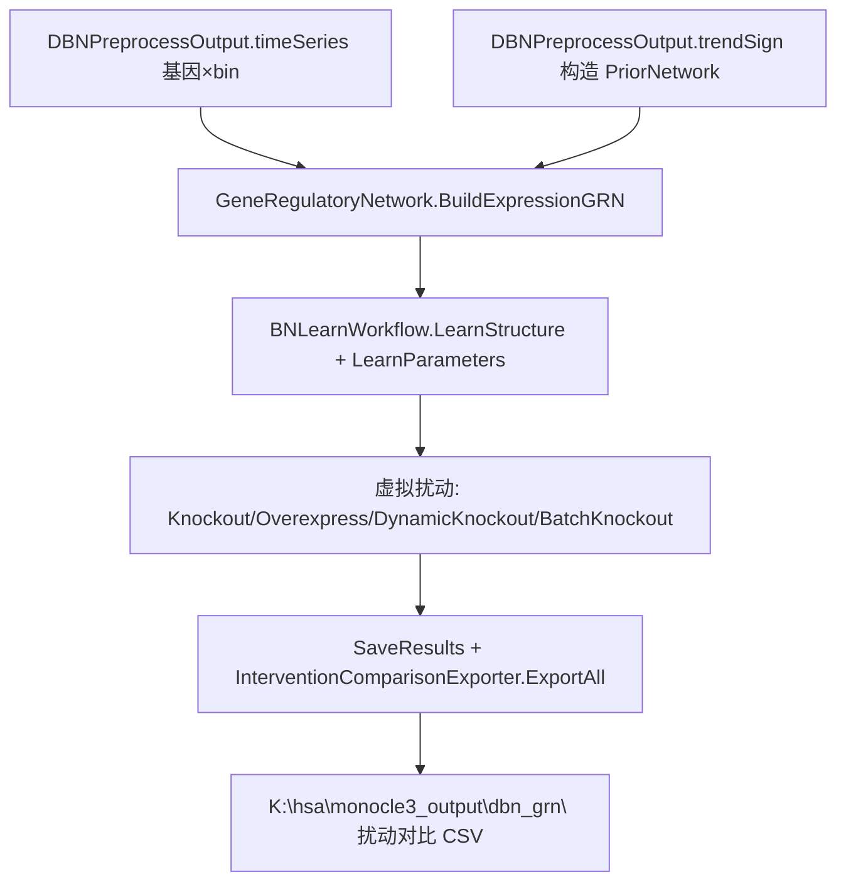

## 用户需求

在现有 `SingleGRN\Program.vb` 端到端流程基础上追加测试代码，并在 `CellPhenotype\GeneRegulatoryNetwork.vb` 中新增函数，基于 SingleGRN 流程已产出的结果数据（DBN 时间序列表达矩阵 + 伪速率方向先验）构建基因表达调控网络模型、执行模型训练，并实现基因表达虚拟扰动分析（敲除 / 过表达 / 动态敲除 / 批量敲除）。虚拟扰动实验代码编写方式参考 `BNLearn\test\Program.vb`。

## 核心功能

- 基于 `DBNPreprocessOutput.timeSeries`（已是 `GeneExpressionData`）构建 BNLearn 高斯贝叶斯网络，并融合由伪速率趋势构造的方向先验。
- 执行结构学习（MMHC + 白名单先验）与参数学习（高斯 BN MLE）。
- 对演示基因执行虚拟敲除、过表达、动态级联敲除与批量敲除，并导出扰动对比结果 CSV。
- 在 `SingleGRN\Program.vb` 中串联上述步骤并运行生成 DEMO 文件供检查。

## 技术栈

- 语言：VB.NET（.NET 10），与现有 CellPhenotype / SingleGRN / BNLearn 一致。
- 复用依赖（已引用，无需新增）：
- `CellPhenotype`（含 `GeneRegulatoryNetwork` 模块，命名空间 `SMRUCC.genomics.Analysis.CellPhenotype`）。
- `BNLearn`（`BNLearnWorkflow` / `PriorNetwork` / `InterventionResult` / `InterventionComparisonExporter`，命名空间 `SMRUCC.genomics.Analysis.BNLearn.Core` 与 `.Intervention`）。
- `SingleGRN`（含 `DBNSampleProcessing.DBNPreprocessOutput`）。

## 实现方案

### 总体策略

以纯内存对象串联已有模块，复用 `BNLearn\test\Program.vb` 的高层扰动 API。新增函数置于 `GeneRegulatoryNetwork.vb`，以 `GeneExpressionData` + `PriorNetwork` 为参数（CellPhenotype 不反向依赖 SingleGRN，避免循环引用）；由 `SingleGRN\Program` 传入 `dbnOut.timeSeries` 与由 `dbnOut.trendSign` 构造的先验。

### 关键设计决策

1. **参数解耦（避免循环依赖）**：CellPhenotype 新函数只接受 `Core.GeneExpressionData` 与 `Core.PriorNetwork`，不直接引用 `SingleGRN.DBNPreprocessOutput`。调用方在 SingleGRN 端把 `dbnOut.timeSeries` 与 `PriorNetwork` 装配后传入。
2. **复用 BNLearnWorkflow 成熟扰动 API**：直接调用 `LearnStructure` / `LearnParameters` / `KnockoutGene` / `OverexpressGene` / `DynamicKnockout` / `BatchKnockout` / `SaveResults`，并使用 `InterventionComparisonExporter.ExportAll`（与参考 test 完全一致；`pathwayInfo` 传 Nothing）。
3. **伪速率方向先验（启发式、可选）**：在 SingleGRN 端取 `selectedGenes` 中 `|trendSign|` 前 N 名的基因作为候选，按趋势正负构造 `上游→下游` 方向边（`Effector.Activator`/`Inhibitor`，权重为 `|trendSign|`，evidence="PseudoVelo trend"）。幅度较小时退化为 `prior=Nothing`（纯数据驱动 MMHC），保证可跑。
4. **性能与稳健性**：`timeSeries` 含 600 基因 × 30 bin，结构学习规模可控；`NSamples=10000` 足够推断稳定。扰动仅对少量演示基因执行，导出文件体积小。

### 实现要点

- `GeneRegulatoryNetwork.BuildExpressionGRN(expr, Optional prior)`：`New BNLearnWorkflow With {.ExpressionData = expr, .PriorNetwork = If(prior, New PriorNetwork())}`，返回 workflow。
- `GeneRegulatoryNetwork.TrainAndIntervene(expr, prior, knockGenes(), Optional overExpr As (Gene, Fold)(), Optional dynamicSteps=10, Optional outputDir)`：

1. `BuildExpressionGRN` → `LearnStructure` → `LearnParameters`。
2. 对每个 knockGene：`KnockoutGene`；对每个 overExpr：`OverexpressGene(gene, fold)`；`DynamicKnockout(gene, dynamicSteps)`；`BatchKnockout(knockGenes)`。
3. 若 `outputDir` 非空：`workflow.SaveResults(outputDir)` + `New InterventionComparisonExporter(c(koResults, oeResults, dynResults), batchResults)).ExportAll(outputDir, Nothing)`。
4. 打印网络节点/边与扰动基因摘要。

- `SingleGRN\Program.vb` 追加段（在 DBN 预处理后）：
- 用 `dbnOut.selectedGenes` + `dbnOut.trendSign` 构造 `PriorNetwork`（仅高幅度基因间连边）。
- 选 `selectedGenes` 速度幅度最大若干作为 knockGenes（含一个过表达演示基因）。
- 调用 `GeneRegulatoryNetwork.TrainAndIntervene(dbnOut.timeSeries, prior, knockGenes, overExpr, dynamicSteps:=10, outputDir:=<monoDir>\dbn_grn)`。
- 打印扰动结果摘要。
- `SingleGRN\Program.vb` 新增 Imports：`SMRUCC.genomics.Analysis.CellPhenotype`、`SMRUCC.genomics.Analysis.BNLearn.Core`、`SMRUCC.genomics.Analysis.BNLearn.Intervention`。

## 架构设计



## 目录结构

```
G:\GCModeller\src\GCModeller\sub-system\CellPhenotype\
└── GeneRegulatoryNetwork.vb   # [MODIFY] 新增 BuildExpressionGRN / TrainAndIntervene 两个公共函数（基于 GeneExpressionData + PriorNetwork，不引用 SingleGRN）

g:\Erica\src\SingleCell\SingleGRN\
└── Program.vb                 # [MODIFY] 追加 Imports 与测试段：用 dbnOut 构造先验、调用 TrainAndIntervene、导出扰动结果并打印摘要
```

## 关键代码结构（示意）

- `Public Function BuildExpressionGRN(expr As Core.GeneExpressionData, Optional prior As Core.PriorNetwork = Nothing) As Core.BNLearnWorkflow`
- `Public Function TrainAndIntervene(expr As Core.GeneExpressionData, prior As Core.PriorNetwork, knockGenes As String(), Optional overExpr As (Gene As String, Fold As Double)() = Nothing, Optional dynamicSteps As Integer = 10, Optional outputDir As String = Nothing) As (workflow As Core.BNLearnWorkflow, knockout As Intervention.InterventionResult(), overExprResults As Intervention.InterventionResult(), dynamic As Intervention.InterventionResult(), batch As IEnumerable(Of Intervention.InterventionResult))`

## Agent Extensions

### SubAgent

- **code-explorer**
- Purpose: 在实现前精确定位 `BNLearnWorkflow` / `PriorNetwork.AddEdge` / `InterventionComparisonExporter` 的命名空间与签名，避免计划落地时引入引用错误。
- Expected outcome: 确认 CellPhenotype 与 SingleGRN 之间无循环依赖，新函数参数类型符合约束，编译可一次通过。