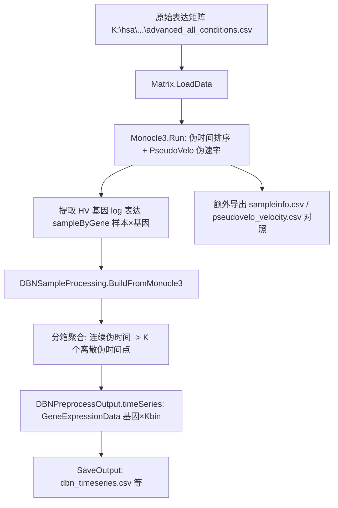

## 用户需求

基于 `Monocle3\test\Program.vb` 使用的原始数据集，在 `SingleGRN\Program.vb` 中构建一条端到端流程，实现"从原始表达矩阵出发，生成最终动态贝叶斯网络（DBN）数据"的完整链路，并在开发完成后实际编译运行，生成 DEMO 测试结果文件供检查。

## 核心功能

- 直接加载原始表达矩阵（行=基因、列=样本），不再依赖先单独运行 Monocle3 测试程序落盘中间 CSV。
- 串联运行 Monocle3（伪时间排序/轨迹推断）、PseudoVelo（伪 RNA 速率）、DBNSampleProcessing（按伪时间分箱聚合为 K 个离散伪时间点），产出 DBN 所需的 `GeneExpressionData` 时间序列。
- 将最终 DBN 时间序列与中间对照产物（sampleinfo、伪速度）导出为 CSV。
- 编译并运行 SingleGRN 工程，生成可检查的 DEMO 文件。

## 产品概述

在 `SingleGRN\Program.vb` 中以内存对象串联既有三个模块：原始表达矩阵 → `Monocle3.Run` → `DBNSampleProcessing.BuildFromMonocle3` → `SaveOutput`，从连续伪时间快照构造离散时间序列，供 GCModeller 的 DBN 参数学习使用。

## 技术栈

- 语言：VB.NET（.NET 10），与现有 SingleGRN / Monocle3 / GCModeller 一致。
- 复用依赖（SingleGRN.vbproj 已引用，无需新增）：
- `HTS_matrix`（Matrix 类，`SMRUCC.genomics.Analysis.HTS.DataFrame`）。
- `..\Monocle3\Monocle3.vbproj`（`Monocle3.Run` / `Monocle3Result` / `PseudoVelocityResult` / `SampleInfo`）。
- `BNLearn`（GeneExpressionData，DBN 目标时间序列结构）。
- `CellPhenotype`（GeneRegulatoryNetwork DBN 模块，后续消费方）。

## 实现方案

### 总体策略

重写 `SingleGRN\Program.vb` 的 `Sub Main`，以纯内存对象串联三个已有模块，避免中间 CSV 落盘与重复文件读取，并复用 Monocle3 的磁盘缓存加速重跑。

### 关键设计决策

1. **端到端串联（内存对象）**：

- `matrix = Matrix.LoadData(exprFile)` 加载原始表达矩阵（行=基因、列=样本）。
- `result = Monocle3.Run(matrix, monoOpts)` 得到 `pseudotime` 与 `pseudoVelocity`（HV 基因 × 细胞，列序=原始样本序=matrix.sampleID 序）。
- 提取 HV 基因表达：`hvGenes = result.pseudoVelocity.geneNames`；建立 `geneID → 行索引` 映射；`sampleByGene(j,g) = log(1 + matrix.expression(row).experiments(j))`，使 DBN 时间序列与 PseudoVelo 速度同源（Monocle3 内部 RunCore 对表达做 log1p 后再算伪时间/速度）。
- `dbnOut = DBNSampleProcessing.BuildFromMonocle3(result, sampleByGene, hvGenes, matrix.sampleID, dbnOpts)`。
- `DBNSampleProcessing.SaveOutput(dbnOut, dbnOutDir)`。

2. **尺度一致性**：对 HV 基因表达统一做 log1p，与 Monocle3 内部 `exprData` 尺度一致；velocity 缺失时回退用全基因表达、velocity 传 Nothing（基因预筛选用沿伪时间方差替代）。
3. **中间产物对照导出**：为便于检查，额外把 `result.ToSampleInfo(sampleNames)` 导出 `sampleinfo.csv`、`pseudovelo_velocity.csv` 导出到 monocle3 输出目录，与已有 Monocle3 test 产物格式一致。
4. **命令行参数**：`SingleGRN.exe [exprFile] [monocle3OutDir] [dbnOutDir]`，默认沿用 `K:\hsa\Homo_sapiens_expr_advanced_all_conditions.csv` 与 `K:\hsa\monocle3_output`，支持无参直接跑 DEMO。
5. **健壮性**：exprFile 不存在即报错退出；hvGenes 为空时回退全基因；维度不一致由 `BuildCore` 显式抛异常（早失败）。

### 实现要点

- `Monocle3Options`：`numPCA=50, umapDim=3, knnK=15, resolution=1.0, useLeiden=False, useCache=True, overwriteCache=False, cacheDir=<monoOut>\cache`，复用缓存避免重算。
- `DBNSampleOptions`：`method="bins", numBins=30, geneSelection="top", topGeneFraction=0.3, discretize=False`。
- 表达式尺度：`sampleByGene(j,g) = Math.Log(1 + raw)`，raw 为 `matrix.expression(rowOfGene).experiments(j)`（列序=matrix.sampleID）。
- 导出辅助：复用 `result.pseudoVelocity.velocity`（基因×细胞）写 `pseudovelo_velocity.csv`；`result.ToSampleInfo(sampleNames)` 写 `sampleinfo.csv`。

## 架构设计



## 目录结构

```
g:\Erica\src\SingleCell\SingleGRN\
└── Program.vb   # [MODIFY] 替换为端到端流程：加载原始矩阵 → Monocle3.Run → 提取 HV log 表达 → BuildFromMonocle3 → SaveOutput → 导出对照 CSV
```

（DBNSampleProcessing.vb / SingleGRN.vbproj / Monocle3 / GCModeller 均不改）

## 关键代码结构（示意）

- `Sub Main(args As String())`：解析参数、LoadData、Monocle3.Run、提取 HV log 表达、BuildFromMonocle3、SaveOutput、导出 sampleinfo/pseudovelo_velocity、打印 Summary。
- 局部：`matrix As Matrix`、`result As Monocle3Result`、`sampleByGene As Double(,)`、`hvGenes As String()`、`dbnOpts As DBNSampleProcessing.DBNSampleOptions`、`dbnOut As DBNSampleProcessing.DBNPreprocessOutput`。