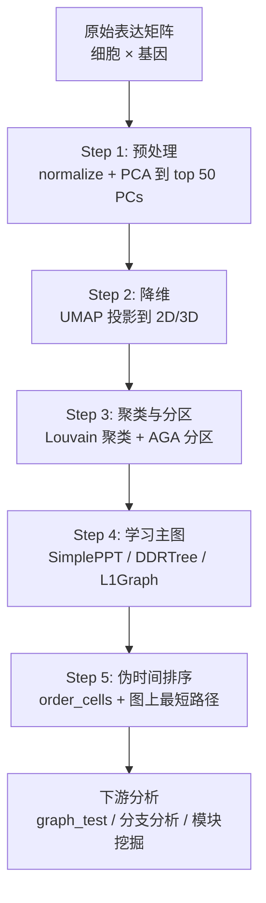

# Monocle3 算法原理详解
## 一、总体定位与核心假设
Monocle3 是 Trapnell 实验室开发的主流形轨迹推断工具，其核心目标是**在没有真实时间标签的情况下，利用样本（细胞）在转录组空间中的流形结构，重构细胞状态转换的有序轨迹，并为每个样本赋予"伪时间"值**。它建立在两个核心假设之上：
1. **转录组连续性假设**：细胞状态转换在表达空间中是连续的，瞬时状态可以通过表达相似度被捕获，因此可以根据表达谱的相似性重建"准时间"序列。
2. **主轨迹假设**：细胞状态转换的主路径可以通过一条嵌入在高维表达空间中的**主图**来刻画，所有细胞都可以投影到这条主图上。
## 二、完整算法流程
Monocle3 的分析流程分为五个核心步骤，可以用如下流程图概括：

下面逐步展开每个环节的数学与算法细节。
---
### Step 1: 数据预处理与 PCA 降维
**输入**：原始计数矩阵（细胞 × 基因），`new_cell_data_set()` 构造 CDS 对象。
**预处理**：`preprocess_cds(cds, num_dim = 50)` 执行两个操作：
- **归一化**：用 size factor 校正测序深度差异，再做对数变换，得到 log-normalized 表达值。
- **PCA 降维**：将高维表达投影到前 50 个主成分（默认值），一方面去噪，另一方面将后续计算压缩到可处理的维度。
**可选批次校正**：`align_cds()` 可基于批次信息（`alignment_group`）或连续协变量（`residual_model_formula_str`，如线粒体比例、背景 RNA 污染）对 PCA 后的坐标进行校正，内部使用 Mutual Nearest Neighbors（MNN）方法。
---
### Step 2: UMAP 非线性降维
**输入**：PCA 后的 50 维坐标。
**输出**：2D 或 3D UMAP 嵌入坐标。
`reduce_dimension(cds, reduction_method = "UMAP")` 使用 UMAP 算法将细胞从 PCA 空间进一步嵌入到二维平面。UMAP 的数学原理可概括为：
1. 在高维空间中构建**模糊单纯集**：对每个点，用半径可变的球找到其 k 近邻，并赋予连接权重（基于局部距离），形成加权图。
2. **优化低维嵌入**：在低维空间中构建类似的模糊图，通过最小化两个模糊单纯集之间的交叉熵，使得低维图中"相近的点对"在高维中也尽可能相近。
3. 初始嵌入用**谱聚类**（拉普拉斯特征映射）获得，随后用随机梯度下降（SGD）迭代优化。
**为什么选择 UMAP 而非 t-SNE**：UMAP 不仅计算更快，更重要的是**能更好地保留全局流形结构**（远距离的拓扑关系），这对轨迹推断至关重要——t-SNE 倾向于破坏簇间距离，可能导致轨迹断裂。
需要注意的是，Monocle3 目前强制要求在 UMAP 空间上学习轨迹图，这一点在社区中有争议（有研究者指出 2D/3D UMAP 会带来失真），但官方认为这是噪声与可解释性的合理折中。
---
### Step 3: 聚类与分区——近似图抽象（AGA）
**输入**：UMAP 坐标。
**输出**：每个细胞获得 和 两个标签。
`cluster_cells(cds)` 同时完成两个任务：
- **Louvain 聚类**：在 UMAP 空间中构建 k 近邻图，用模块度优化算法将细胞分成若干细粒度簇。
- **分区**：借鉴 **Approximate Graph Abstraction（AGA，即 PAGA 的前身）** 的思想，对簇之间的连通性进行统计检验，把强连通的簇合并为一个"分区"。分区之间的连接被判定为不可信（可能是噪声或不同生物过程），因此被切断。
**PAGA 的数学原理**：对簇 之间的连通性，PAGA 计算一个 **connectivity score**：
$$\text{connectivity}(i,j) = \frac{\sum_{u \in C_i, v \in C_j} w_{uv}}{\sqrt{|C_i| \cdot |C_j|}}$$
其中 $w_{uv}$ 是原始 kNN 图中连接细胞 $u$ 和 $v$ 的边权。这个分数衡量了两个簇之间的"实际连接强度"，通过随机置换检验判断其显著性，只保留显著连通的部分。
**为什么需要分区**：Monocle2 假设所有细胞都属于单一轨迹，这在包含多种独立分化过程的组织（如免疫细胞和基质细胞对感染的不同响应）中会导致错误的"伪轨迹"。Monocle3 通过分区允许多条不相交的轨迹并行存在，每个分区独立学习其主图。
---
### Step 4: 学习主图——核心算法
**输入**：每个分区内部的细胞 UMAP 坐标。
**输出**：一张嵌入在 UMAP 空间中的**主图**。
`learn_graph(cds)` 是 Monocle3 的核心，其本质是**反向图嵌入** 的优化问题。
#### RGE 的数学形式
给定细胞在低维（UMAP）空间的坐标 $X = \{x_1, ..., x_n\}$，目标是学习一个**图 $G = (V, E, B)$**（$V$ 是图节点集合，$B$ 是邻接矩阵）和图节点的嵌入坐标 $Y = \{y_1, ..., y_m\}$，使得：
$$\min_{G, Y} \sum_{i=1}^{n} \| x_i - y_{\pi(i)} \|^2 + \lambda \cdot \text{regularization}(G)$$
其中 $\pi(i)$ 表示细胞 $i$ 被分配到的最近图节点，$\lambda$ 正则化项控制图的复杂度（如树的平滑性或稀疏性）。
Monocle3 提供三种具体的图学习算法：
| 方法 | Monocle2/3 关系 | 图结构 | 核心特点 |
|------|-----------------|--------|----------|
| **DDRTree** | Monocle2 主算法 | 树 | 同时降维 + 学习图；可扩展至百万细胞 |
| **SimplePPT** | Monocle3 新增 | 树 | **Monocle3 默认方法**；只学习图，不再额外降维 |
| **L1Graph** | Monocle3 新增 | 可含环 | 使用 L1 正则化优化，可学习带环路或汇聚点的复杂轨迹 |
#### SimplePPT 算法详解（默认方法）
SimplePPT（Simple Principal Tree）的核心思想是**在 UMAP 空间中直接拟合一棵树**，步骤如下：
1. **初始化**：用 MST（最小生成树）作为初始树结构。
2. **交替优化**：
   - **固定图结构，优化节点位置**：最小化所有细胞到其最近图节点的欧氏距离平方和（类似 k-means 的 assignment step）。
   - **固定节点位置，优化图结构**：在图节点之间重新计算 MST，以减少树的复杂度。
3. **收敛**：交替迭代直到节点位置和图结构不再变化。
SimplePPT 的优点在于它**不需要假设潜在维度**（因为它直接在 UMAP 坐标上工作），并且计算效率高。
#### DDRTree 与 SimplePPT 的区别
DDRTree 在 Monocle2 中同时完成两个任务：(1) 将细胞从原始高维空间映射到一个中间低维空间（隐式降维），(2) 在该低维空间中学习主图。而 Monocle3 中由于 UMAP 已完成了降维任务，SimplePPT 只需专注于第二步——**图学习**，因此更简洁高效。
#### L1Graph 处理环路
L1Graph 在目标函数中加入 L1 范数惩罚，允许图节点形成闭环（如细胞周期或分化后的再循环），克服了树结构无法表示环路轨迹的局限。
---
### Step 5: 伪时间排序
**输入**：学习好的主图 + 用户指定的根节点。
**输出**：每个细胞的伪时间值 `pseudotime`。
`order_cells(cds, root_pr_nodes = ...)` 的计算逻辑：
1. **指定根节点**：用户需在图上选择一个或多个"根"（代表过程的起始状态）。常见策略有：
   - 已知早期标记基因高表达的细胞所在的图节点；
   - 已知早期时间点细胞聚集的节点（用辅助函数如 `get_earliest_principal_node()` 自动选取）。
2. **细胞投影到图**：每个细胞被分配到最近的图节点。
3. **图上最短路径**：用 Dijkstra 算法计算从根节点到每个图节点的最短路径长度。
4. **伪时间定义**：
$$\text{pseudotime}(c) = \text{shortest\_path\_length}(\text{root}, v_{\pi(c)})$$
即细胞 $c$ 的伪时间等于其最近图节点 $v_{\pi(c)}$ 到根节点的最短路径距离。
> 伪时间的物理含义：**从起始状态到该细胞所经历的"转录组变化总量"**，而非真实时间。
若某个分区没有指定根节点，该分区细胞的伪时间会被赋为无穷大（绘图时显示为灰色）。
---
### 下游分析：graph_test 与 Moran's I
得到伪时间后，`graph_test(cds, neighbor_graph = "principal_graph")` 用于检测**沿轨迹变化显著的基因**，其核心统计量是 **Moran's I**（莫兰指数）：
$$I = \frac{n}{W} \cdot \frac{\sum_i \sum_j w_{ij} (x_i - \bar{x})(x_j - \bar{x})}{\sum_i (x_i - \bar{x})^2}$$
其中 $w_{ij}$ 是细胞 $i$ 和 $j$ 在主图上的邻接权重，$x_i$ 是基因在细胞 $i$ 中的表达量。Moran's I 的取值范围是 [-1, 1]：
- **I 接近 1**：基因表达沿轨迹呈现强空间自相关（即在轨迹上相邻的细胞表达相似），说明该基因随伪时间呈现有序变化。
- **I 接近 0**：基因表达与轨迹位置无关。
进一步可用 `find_gene_modules()` 将显著变化基因聚成共表达模块，并用 `plot_genes_in_pseudotime()` 可视化基因随伪时间的表达趋势。
---
## 三、关键算法模块对比表
| 算法模块 | 所在步骤 | 数学目标 | 输出 |
|----------|----------|----------|------|
| PCA + 归一化 | Step 1 | 去噪、压缩到 50 维 | 50 维 PCA 坐标 |
| UMAP | Step 2 | 保留全局流形结构的非线性降维 | 2D/3D 嵌入 |
| Louvain + AGA/PAGA | Step 3 | 粗粒化连通性估计，允许不相交轨迹 | 分区标签 partition |
| SimplePPT / DDRTree / L1Graph | Step 4 | 反向图嵌入，学习主图 | 主图 G（节点+边） |
| Dijkstra + 根节点 | Step 5 | 沿图最短路径计算伪时间 | 每个细胞的 pseudotime |
| Moran's I | 下游 | 检测沿轨迹变化的基因 | 显著基因列表 |
---
## 四、输入输出与关键参数
### 输入
- **表达矩阵**：细胞 × 基因 的计数矩阵或已归一化矩阵。
- **细胞元数据**：包含批次、已知时间点、细胞类型注释等信息。
- **基因注释**：基因 ID 与名称对应表。
### 输出
- **主图**：`principal_graph(cds)` 返回一个 igraph 对象，描述节点、边及节点坐标。
- **伪时间向量**：`pseudotime(cds)` 返回每个细胞的伪时间值。
- **分区标签**：`partitions(cds)` 返回分区归属，用于识别不相交轨迹。
- **分支信息**：叶节点 和分支点 在图中被特殊标记，用于后续分支分析。
### 关键参数
- `num_dim`：预处理保留的主成分数，默认 50。
- `reduction_method`：降维方法，轨迹分析强烈建议使用 "UMAP"。
- `learn_graph_control`：控制主图学习参数，如 `principal_graph_algorithm` 可选 "DDRTree"（默认 SimplePPT 在内部处理）、`ncenter` 图节点数（默认根据细胞数自动）。
- `root_pr_nodes`：根节点，可为单个或多个，每个分区至少一个。
---
## 五、与 Monocle2 的核心区别
| 特性 | Monocle2 | Monocle3 |
|------|----------|----------|
| 降维方法 | DDRTree（自带降维） | PCA → UMAP（分离降维与图学习） |
| 轨迹结构 | 仅支持单棵树 | 支持多分区、不相交轨迹、环路（L1Graph） |
| 数据规模 | 万级细胞 | 百万级细胞（DDRTree 优化后） |
| 根节点 | 通过 `root_state` 隐式指定 | 显式交互式选择或程序化指定 |
| 差异分析 | `differentialGeneTest()`、`BEAM` | `graph_test()`（基于 Moran's I）、分支分析重构 |
| 理论基础 | RGE（DDRTree） | RGE + AGA/PAGA + UMAP |
---
## 六、适用性与局限性
### 适用场景
- **单细胞 RNA-seq**：大规模细胞群体的分化、发育、重编程轨迹重建。
- **空间转录组**：已有研究将 Monocle3 用于空间轨迹分析，揭示细胞在空间中的分化关系。
- **bulk 转录组的伪时间排序**：Monocle3 的核心思想（PCA → UMAP → 主图 → 伪时间）同样适用于 bulk 时序样本的排序问题。只要样本量足够（一般 ≥ 20-30 个），可以将每个 bulk 样本视为一个"细胞"输入 Monocle3，但需注意：
  - bulk 数据没有单细胞的稀疏性问题，PCA 保留的维度可适当降低；
  - 样本量少时 UMAP 可能不稳定，需谨慎解读轨迹结构；
  - 分区功能在 bulk 中意义有限（样本太少，通常只有一个分区）。
### 局限性
1. **UMAP 强依赖**：轨迹学习固定在 UMAP 空间上进行，2D 投影可能扭曲高维结构，导致主图失真。
2. **根节点主观性**：伪时间方向完全依赖用户指定的根节点，若根节点选择错误，整个轨迹方向会反转。
3. **对连续过程敏感，对离散跳变不敏感**：若细胞状态转换是突变的（非连续），主图拟合可能失败或产生误导性轨迹。
4. **计算资源**：虽然 DDRTree 在 Monocle3 中经过优化，但百万级细胞的 UMAP 和图学习仍需较高内存。
5. **bulk 数据适用性有限**：Monocle3 的许多假设（如转录组稀疏性、dropout 模型）针对单细胞设计，对 bulk 数据需自行调整预处理流程。
---
## 七、总结
**Monocle3 的算法核心是"UMAP 降维 + 分区图抽象 + 反向图嵌入学习主图 + 图上最短路径计算伪时间"**。它通过引入 UMAP 解决了全局结构保留问题，通过 AGA/PAGA 分区解决了多轨迹并行问题，通过 SimplePPT/L1Graph 等主图学习算法解决了复杂拓扑（树、环）的拟合问题，最终以图上距离定义伪时间，实现了无时间标签条件下的样本排序。
对于转录组矩阵的伪时间排序需求，Monocle3 提供了完整且成熟的解决方案，尤其适合样本量较大、可能存在分支轨迹的场景；但对于样本量较小的 bulk 时序数据，建议结合 PCA + 主曲线或 Seriation 等更轻量的方法进行交叉验证。
